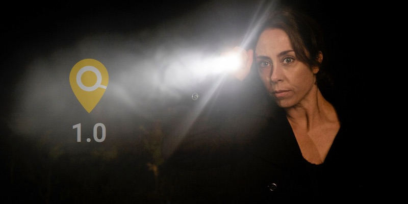

# Change Log
All notable changes to this project will be documented in this file.
This project adheres to [Semantic Versioning](http://semver.org/).

About changelog [here](https://keepachangelog.com/en/1.0.0/)

## [4.79]
### Added
- Added tags for Sniffles and CNVpytor, two LRS SV callers
- Button on case page for displaying STR variants occurring in the dynamic HPO panel
- Display functional annotation relative to variant gene's MANE transcripts on variant summary, when available
- Links to ACMG structural variant pathogenicity classification guidelines
- Phenomodels checkboxes can now include orpha terms
- Add incidental finding to case tags
### Changed
- In the diagnoses page genes associated with a disease are displayed using hgnc symbol instead of hgnc id
- Refactor view route to allow navigation directly to unique variant document id, improve permissions check
- Do not show MANE and MANE Plus Clinical transcripts annotated from VEP (saved in variants) but collect this info from the transcripts database collection
- Refactor view route to allow navigation directly to unique case id (in particular for gens)
- `Institutes to share cases with` on institute's settings page now displays institutes names and IDs
- View route with document id selects view template based on variant category
### Fixed
- Refactored code in cases blueprints and variant_events adapter (set diseases for partial causative variants) to use "disease" instead of "omim" to encompass also ORPHA terms
- Refactored code in `scout/parse/omim.py` and `scout/parse/disease_terms.py` to use "disease" instead of "phenotype" to differentiate from HPO terms
- Be more careful about checking access to variant on API access
- Show also ACMG VUS on general report (could be missing if not e.g. pinned)

## [4.78]
### Added
- Case status labels can be added, giving more finegrained details on a solved status (provisional, diagnostic, carrier, UPD, SMN, ...)
- New SO terms: `sequence_variant` and `coding_transcript_variant`
- More MEI specific annotation is shown on the variant page
- Parse and save MANE transcripts info when updating genes in build 38
- `Mane Select` and `Mane Plus Clinical` badges on Gene page, when available
- ClinVar submission can now be downloaded as a json file
- API endpoint to pin variant
- Display common/uncommon/rare on summary of mei variant page
### Changed
- In the ClinVar form, database and id of assertion criteria citation are now separate inputs
- Customise institute settings to be able to display all cases with a certain status on cases page (admin users)
- Renamed `Clinical Significance` to `Germline Classification` on multistep ClinVar form
- Changed the "x" in cases.utils.remove_form button text to red for better visibility in dark mode
- Update GitHub actions
- Default loglevel up to INFO, making logs with default start easier to read
- Add XTR region to PAR region definition
- Diagnoses can be searched on diagnoses page without waiting for load first
### Fixed
- Removed log info showing hgnc IDs used in variantS search
- Maintain Matchmaker Exchange and Beacon submission status when a case is re-uploaded
- Inheritance mode from ORPHA should not be confounded with the OMIM inheritance model
- Decipher link URL changes
- Refactored code in cases blueprints to use "disease" instead of "omim" to encompass also ORPHA terms

## [4.77]
### Added
- Orpha disease terms now include information on inheritance
- Case loading via .yaml config file accepts subject_id and phenotype_groups (if previously defined as constant default or added per institute)
- Possibility to submit variants associated with Orphanet conditions to ClinVar
- Option update path to .d4 files path for individuals of an existing case using the command line
- More constraint information is displayed per gene in addition to pLi: missense and LoF OE, CI (inluding LOEUF) and Z-score.
### Changed
- Introduce validation in the ClinVar multistep form to make sure users provide at least one variant-associated condition
- CLI scout update individual accepts subject_id
- Update ClinVar inheritance models to reflect changes in ClinVar submission API
- Handle variant-associated condition ID format in background when creating ClinVar submissions
- Replace the code that downloads Ensembl genes, transcripts and exons with the Schug web app
- Add more info to error log when transcript variant frequency parsing fails.
- GnomAD v4 constraint information replaces ExAC constraints (pLi).
### Fixed
- Text input of associated condition in ClinVar form now aligns to the left
- Alignment of contents in the case report has been updated
- Missing number of phenotypes and genes from case diagnoses
- Associate OMIM and/or ORPHA diagnoses with partial causatives
- Visualization of partial causatives' diagnoses on case page: style and links
- Revert style of pinned variants window on the case page
- Rename `Clinical significanc` to `Germline classification` in ClinVar submissions exported files
- Rename `Clinical significance citations` to `Classification citations` in ClinVar submissions exported files
- Rename `Comment on clinical significance` to `Comment on classification` in ClinVar submissions exported files
- Show matching partial causatives on variant page
- Matching causatives shown on case page consisting only of variant matching the default panels of the case - bug introduced since scout v4.72 (Oct 18, 2023)
- Missing somatic variant read depth leading to report division by zero

## [4.76]
### Added
- Orphacodes are visible in phenotype tables
- Pydantic validation of image paths provided in case load config file
- Info on the user which created a ClinVar submission, when available
- Associate .d4 files to case individuals when loading a case via config file
### Changed
- In diagnoses page the load of diseases are initiated by clicking a button
- Revel score, Revel rank score and SpliceAI values are also displayed in Causatives and Validated variants tables
- Remove unused functions and tests
- Analysis type and direct link from cases list for OGM cases
- Removed unused `case_obj` parameter from server/blueprints/variant/controllers/observations function
- Possibility to reset ClinVar submission ID
- Allow ClinVar submissions with custom API key for users registered as ClinVar submitters or when institute doesn't have a preset list of ClinVar submitters
- Ordered event verbs alphabetically and created ClinVar-related user events
- Removed the unused "no-variants" option from the load case command line
### Fixed
- All disease_terms have gene HGNC ids as integers when added to the scout database
- Disease_term identifiers are now prefixed with the name of the coding system
- Command line crashing with error when updating a user that doesn't exist
- Thaw coloredlogs - 15.0.1 restores errorhandler issue
- Thaw crypography - current base image and library version allow Docker builds
- Missing delete icons on phenomodels page
- Missing cryptography lib error while running Scout container on an ARM processor
- Round CADD values with many decimals on causatives and validated variants pages
- Dark-mode visibility of some fields on causatives and validated variants pages
- Clinvar submitters would be cleared when unprivileged users saved institute settings page
- Added a default empty string in cases search form to avoid None default value
- Page crashing when user tries to remove the same variant from a ClinVar submission in different browser tabs
- Update more GnomAD links to GnomAD v4 (v38 SNVs, MT vars, STRs)
- Empty cells for RNA fusion variants in Causatives and Verified variants page
- Submenu icons missing from collapsible actionbar
- The collapsible actionbar had some non-collapsing overly long entries
- Cancer observations for SVs not appearing in the variant details view
- Archived local observations not visible on cancer variantS page
- Empty Population Frequency column in the Cancer SV Variants view
- Capital letters in ClinVar events description shown on case page

## [4.75]
### Added
- Hovertip to gene panel names with associated genes in variant view, when variant covers more than one gene
- Tests for panel to genes
- Download of Orphadata en_product6 and en_product4 from CLI
- Parse and save `database_found` key/values for RNA fusion variants
- Added fusion_score, ffpm, split_reads, junction_reads and fusion_caller to the list of filters on RNA fusion variants page
- Renamed the function `get_mei_info` to `set_mei_info` to be consistent with the other functions
- Fixed removing None key/values from parsed variants
- Orphacodes are included in the database disease_terms
### Changed
- Allow use of projections when retrieving gene panels
- Do not save custom images as binary data into case and variant database documents
- Retrieve and display case and variant custom images using image's saved path
- Cases are activated by viewing FSHD and SMA reports
- Split multi-gene SNV variants into single genes when submitting to Matchmaker Exchange
- Alamut links also on the gene level, using transcript and HGVS: better for indels. Keep variant link for missing HGVS
- Thaw WTForms - explicitly coerce form decimal field entries when filters fetched from db
### Fixed
- Removed some extra characters from top of general report left over from FontAwsome fix
- Do not save fusion variants-specific key/values in other types of variants
- Alamut link for MT variants in build 38
- Convert RNA fusions variants `tool_hits` and `fusion_score` keys from string to numbers
- Fix genotype reference and alternative sequencing depths defaulting to -1 when values are 0
- DecimalFields were limited to two decimal places for several forms - lifting restrictions on AF, CADD etc.

## [4.74.1]
### Changed
- Parse and save into database also OMIM terms not associated to genes
### Fixed
- BioNano API FSHD report requests are GET in Access 1.8, were POST in 1.7
- Update more FontAwesome icons to avoid Pro icons
- Test if files still exist before attempting to load research variants
- Parsing of genotypes error, resulting in -1 values when alt or ref read depths are 0

## [4.74]
### Added
- SNVs and Indels, MEI and str variants genes have links to Decipher
- An `owner + case display name` index for cases database collection
- Test and fixtures for RNA fusion case page
- Load and display fusion variants from VCF files as the other variant types
- Option to update case document with path to mei variants (clinical and research)
### Changed
- Details on variant type and category for audit filters on case general report
- Enable Gens CN profile button also in somatic case view
- Fix case of analysis type check for Gens analysis button - only show for WGS
### Fixed
- loqusdb table no longer has empty row below each loqusid
- MatchMaker submission details page crashing because of change in date format returned by PatientMatcher
- Variant external links buttons style does not change color when visited
- Hide compounds with compounds follow filter for region or function would fail for variants in multiple genes
- Updated FontAwesome version to fix missing icons

## [4.73]
### Added
- Shortcut button for HPO panel MEI variants from case page
- Export managed variants from CLI
### Changed
- STRs visualization on case panel to emphasize abnormal repeat count and associated condition
- Removed cytoband column from STRs variant view on case report
- More long integers formatted with thin spaces, and copy to clipboard buttons added
### Fixed
- OMIM table is scrollable if higher than 700px on SV page
- Pinned variants validation badge is now red for false positives.
- Case display name defaulting to case ID when `family_name` or `display_name` are missing from case upload config file
- Expanded menu visible at screen sizes below 1000px now has background color
- The image in ClinVar howto-modal is now responsive
- Clicking on a case in case groups when case was already removed from group in another browser tab
- Page crashing when saving filters for mei variants
- Link visited color of images

## [4.72.4]
### Changed
- Automatic test mongod version increased to v7
### Fixed
- GnomAD now defaults to hg38 - change build 37 links accordingly

## [4.72.3]
### Fixed
- Somatic general case report small variant table can crash with unclassified variants

## [4.72.2]
### Changed
- A gunicorn maxrequests parameter for Docker server image - default to 1200
- STR export limit increased to 500, as for other variants
- Prevent long number wrapping and use thin spaces for separation, as per standards from SI, NIST, IUPAC, BIPM.
- Speed up case retrieval and lower memory use by projecting case queries
- Make relatedness check fails stand out a little more to new users
- Speed up case retrieval and lower memory use by projecting case queries
- Speed up variant pages by projecting only the necessary keys in disease collection query
### Fixed
- Huge memory use caused by cases and variants pages pulling complete disease documents from DB
- Do not include genes fetched from HPO terms when loading diseases
- Consider the renamed fields `Approved Symbol` -> `Approved Gene Symbol` and `Gene Symbols` -> `Gene/Locus And Other Related Symbols` when parsing OMIM terms from genemap2.txt file

## [4.72.1]
### Fixed
- Jinja filter that renders long integers
- Case cache when looking for causatives in other cases causing the server to hang

## [4.72]
### Added
- A GitHub action that checks for broken internal links in docs pages
- Link validation settings in mkdocs.yml file
- Load and display full RNA alignments on alignment viewer
- Genome build check when loading a case
- Extend event index to previous causative variants and always load them
### Fixed
- Documentation nav links for a few documents
- Slightly extended the BioNano Genomics Access integration docs
- Loading of SVs when VCF is missing the INFO.END field but has INFO.SVLEN field
- Escape protein sequence name (if available) in case general report to render special characters correctly
- CaseS HPO term searches for multiple terms works independent of order
- CaseS search regexp should not allow backslash
- CaseS cohort tags can contain whitespace and still match
- Remove diagnoses from cases even if OMIM term is not found in the database
- Parsing of disease-associated genes
- Removed an annoying warning while updating database's disease terms
- Displaying custom case images loaded with scout version <= 4.71
- Use pydantic version >=2 in requirements.txt file
### Changed
- Column width adjustment on caseS page
- Use Python 3.11 in tests
- Update some github actions
- Upgraded Pydantic to version 2
- Case validation fails on loading when associated files (alignments, VCFs and reports) are not present on disk
- Case validation fails on loading when custom images have format different then ["gif", "svg", "png", "jpg", "jpeg"]
- Custom images keys `case` and `str` in case config yaml file are renamed to `case_images` and `str_variants_images`
- Simplify and speed up case general report code
- Speed up case retrieval in case_matching_causatives
- Upgrade pymongo to version 4
- When updating disease terms, check that all terms are consistent with a DiseaseTerm model before dropping the old collection
- Better separation between modules loading HPO terms and diseases
- Deleted unused scout.build.phenotype module
- Stricter validation of mandatory genome build key when loading a case. Allowed values are ['37','38',37,38]
- Improved readability of variants length and coordinates on variantS pages

## [4.71]
### Added
- Added Balsamic keys for SweGen and loqusdb local archive frequecies, SNV and SV
- New filter option for Cancer variantS: local archive RD loqusdb
- Show annotated observations on SV variantS view, also for cancer somatic SVs
- Revel filter for variantS
- Show case default panel on caseS page
- CADD filter for Cancer Somatic SNV variantS - show score
- SpliceAI-lookup link (BROAD, shows SpliceAI and Pangolin) from variant page
- BioNano Access server API - check projects, samples and fetch FSHD reports
### Fixed
- Name of reference genome build for RNA for compatibility with IGV locus search change
- Howto to run the Docker image on Mac computers in `admin-guide/containers/container-deploy.md`
- Link to Weasyprint installation howto in README file
- Avoid filling up disk by creating a reduced VCF file for every variant that is visualized
- Remove legacy incorrectly formatted CODEOWNERS file
- Restrain variant_type requests to variantS views to "clinical" or "research"
- Visualization of cancer variants where cancer case has no affected individual
- ProteinPaint gene link (small StJude API change)
- Causative MEI variant link on causatives page
- Bionano access api settings commented out by default in Scout demo config file.
- Do not show FSHD button on freshly loaded cases without bionano_access individuals
- Truncate long variants' HGVS on causative/Clinically significant and pinned variants case panels
### Changed
- Remove function call that tracks users' browser version
- Include three more splice variant SO terms in clinical filter severe SO terms
- Drop old HPO term collection only after parsing and validation of new terms completes
- Move score to own column on Cancer Somatic SNV variantS page
- Refactored a few complex case operations, breaking out sub functionalities

## [4.70]
### Added
- Download a list of Gene Variants (max 500) resulting from SNVs and Indels search
- Variant PubMed link to search for gene symbol and any aliases
### Changed
- Clearer gnomAD values in Variants page
### Fixed
- CaseS page uniform column widths
- Include ClinVar variants into a scrollable div element on Case page
- `canonical_transcript` variable not initialized in get_hgvs function (server.blueprints.institutes.controllers.py)
- Catch and display any error while importing Phenopacket info
- Modified Docker files to use python:3.8-slim-bullseye to prevent gunicorn workers booting error

## [4.69]
### Added
- ClinVar submission howto available also on Case page
- Somatic score and filtering for somatic SV callers, if available
- Show caller as a tooltip on variantS list
### Fixed
- Crash when attempting to export phenotype from a case that had never had phenotypes
- Aesthetic fix to Causative and Pinned Variants on Case page
- Structural inconsistency for ClinVar Blueprint templates
- Updated igv.js to 2.15.8 to fix track default color bug
- Fixed release versions for actions.
- Freeze tornado below 6.3.0 for compatibility with livereload 2.6.3
- Force update variants count on case re-upload
- IGV locus search not working - add genome reference id
- Pin links to MEI variants should end up on MEI not SV variant view
- Load also matching MEI variants on forced region load
- Allow excluding MEI from case variant deletion
- Fixed the name of the assigned user when the internal user ID is different from the user email address
- Gene variantS should display gene function, region and full hgvs
### Changed
- FontAwesome integrity check fail (updated resource)
- Removed ClinVar API validation buttons in favour of direct API submission
- Improved layout of Institute settings page
- ClinVar API key and allowed submitters are set in the Institute settings page


## [4.68]
### Added
- Rare Disease Mobile Element Insertion variants view
### Changed
- Updated igv.js to 2.15.6
### Fixed
- Docker stage build pycairo.
- Restore SNV and SV rank models versions on Causatives and Verified pages
- Saving `REVEL_RANKSCORE` value in a field named `revel` in variants database documents

## [4.67]
### Added
- Prepare to filter local SV frequency
### Changed
- Speed up instituteS page loading by refactoring cases/institutes query
- Clinical Filter for SVs includes `splice_polypyrimidine_tract_variant` as a severe consequence
- Clinical Filter for SVs includes local variant frequency freeze ("old") for filtering, starting at 30 counts
- Speed up caseS page loading by adding status to index and refactoring totals count
- HPO file parsing is updated to reflect that HPO have changed a few downloadable file formats with their 230405 release.
### Fixed
- Page crashing when a user tries to edit a comment that was removed
- Warning instead of crashed page when attempting to retrieve a non-existent Phenopacket
- Fixed StJude ProteinPaint gene link (URL change)
- Freeze of werkzeug library to version<2.3 to avoid problems resulting from the consequential upgrade of the Flask lib
- Huge list of genes in case report for megabases-long structural variants.
- Fix displaying institutes without associated cases on institutes page
- Fix default panel selection on SVs in cancer case report

## [4.66]
### Changed
- Moved Phenomodels code under a dedicated blueprint
- Updated the instructions to load custom case report under admin guide
- Keep variants filter window collapsed except when user expands it to filter
### Added
- A summary table of pinned variants on the cancer case general report
- New openable matching causatives and managed variants lists for default gene panels only for convenience
### Fixed
- Gens structural variant page link individual id typo

## [4.65.2]
### Fixed
- Generating general case report with str variants containing comments

## [4.65.1]
### Fixed
- Visibility of `Gene(s)` badges on SV VariantS page
- Hide dismiss bar on SV page not working well
- Delivery report PDF download
- Saving Pipeline version file when loading a case
- Backport compatible import of importlib metadata for old python versions (<3.8)

## [4.65]
### Added
- Option to mark a ClinVar submission as submitted
- Docs on how to create/update the PanelApp green genes as a system admin
- `individual_id`-parameter to both Gens links
- Download a gene panel in TXT format from gene panel page
- Panel gene comments on variant page: genes in panels can have comments that describe the gene in a panel context
### Changed
- Always show each case category on caseS page, even if 0 cases in total or after current query
- Improved sorting of ClinVar submissions
- Pre-populate SV type select in ClinVar submission form, when possible
- Show comment badges in related comments tables on general report
- Updated version of several GitHub actions
- Migrate from deprecated `pkg_resources` lib to `importlib_resources`
- Dismiss bar on variantS pages is thinner.
- Dismiss bar on variantS pages can be toggled open or closed for the duration of a login session.
### Fixed
- Fixed Sanger order / Cancel order modal close buttons
- Visibility of SV type in ClinVar submission form
- Fixed a couple of creations where now was called twice, so updated_at and created_at could differ
- Deprecated Ubuntu version 18.04 in one GitHub action
- Panels that have been removed (hidden) should not be visible in views where overlapping gene panels for genes are shown
- Gene panel test pointing to the right function

## [4.64]
### Added
- Create/Update a gene panel containing all PanelApp green genes (`scout update panelapp-green -i <cust_id>`)
- Links for ACMG pathogenicity impact modification on the ACMG classification page
### Changed
- Open local observation matching cases in new windows
### Fixed
- Matching manual ranked variants are now shown also on the somatic variant page
- VarSome links to hg19/GRCh37
- Managed variants filter settings lost when navigating to additional pages
- Collect the right variant category after submitting filter form from research variantS page
- Beacon links are templated and support variants in genome build 38

## [4.63]
### Added
- Display data sharing info for ClinVar, Matchmaker Exchange and Beacon in a dedicated column on Cases page
- Test for `commands.download.omim.print_omim`
- Display dismissed variants comments on general case report
- Modify ACMG pathogenicity impact (most commonly PVS1, PS3) based on strength of evidence with lab director's professional judgement
- REViewer button on STR variant page
- Alamut institution parameter in institute settings for Alamut Visual Plus software
- Added Manual Ranks Risk Factor, Likely Risk Factor and Uncertain Risk Factor
- Display matching manual ranks from previous cases the user has access to on VariantS and Variant pages
- Link to gnomAD gene SVs v2.1 for SV variants with gnomAD frequency
- Support for nf-core/rnafusion reports
### Changed
- Display chrY for sex unknown
- Deprecate legacy scout_load() method API call.
- Message shown when variant tag is updated for a variant
- When all ACMG classifications are deleted from a variant, the current variant classification status is also reset.
- Refactored the functions that collect causative variants
- Removed `scripts/generate_test_data.py`
### Fixed
- Default IGV tracks (genes, ClinVar, ClinVar CNVs) showing even if user unselects them all
- Freeze Flask-Babel below v3.0 due to issue with a locale decorator
- Thaw Flask-Babel and fix according to v3 standard. Thank you @TkTech!
- Show matching causatives on somatic structural variant page
- Visibility of gene names and functional annotations on Causatives/Verified pages
- Panel version can be manually set to floating point numbers, when modified
- Causatives page showing also non-causative variants matching causatives in other cases
- ClinVar form submission for variants with no selected transcript and HGVS
- Validating and submitting ClinVar objects not containing both Variant and Casedata info

## [4.62.1]
### Fixed
- Case page crashing when adding a case to a group without providing a valid case name

## [4.62]
### Added
- Validate ClinVar submission objects using the ClinVar API
- Wrote tests for case and variant API endpoints
- Create ClinVar submissions from Scout using the ClinVar API
- Export Phenopacket for affected individual
- Import Phenopacket from JSON file or Phenopacket API backend server
- Use the new case name option for GENS requests
- Pre-validate refseq:HGVS items using VariantValidator in ClinVar submission form
### Fixed
- Fallback for empty alignment index for REViewer service
- Source link out for MIP 11.1 reference STR annotation
- Avoid duplicate causatives and pinned variants
- ClinVar clinical significance displays only the ACMG terms when user selects ACMG 2015 as assertion criteria
- Spacing between icon and text on Beacon and MatchMaker links on case page sidebar
- Truncate IDs and HGVS representations in ClinVar pages if longer than 25 characters
- Update ClinVar submission ID form
- Handle connection timeout when sending requests requests to external web services
- Validate any ClinVar submission regardless of its status
- Empty Phenopackets import crashes
- Stop Spinner on Phenopacket JSON download
### Changed
- Updated ClinVar submission instructions

## [4.61.1]
### Fixed
- Added `UMLS` as an option of `Condition ID type` in ClinVar Variant downloaded files
- Missing value for `Condition ID type` in ClinVar Variant downloaded files
- Possibility to open, close or delete a ClinVar submission even if it doesn't have an associated name
- Save SV type, ref and alt n. copies to exported ClinVar files
- Inner and outer start and stop SV coordinates not exported in ClinVar files
- ClinVar submissions page crashing when SV files don't contain breakpoint exact coordinates
- Align OMIM diagnoses with delete diagnosis button on case page
- In ClinVar form, reset condition list and customize help when condition ID changes

## [4.61]
### Added
- Filter case list by cases with variants in ClinVar submission
- Filter case list by cases containing RNA-seq data - gene_fusion_reports and sample-level tracks (splice junctions and RNA coverage)
- Additional case category `Ignored`, to be used for cases that don't fall in the existing 'inactive', 'archived', 'solved', 'prioritized' categories
- Display number of cases shown / total number of cases available for each category on Cases page
- Moved buttons to modify case status from sidebar to main case page
- Link to Mutalyzer Normalizer tool on variant's transcripts overview to retrieve official HVGS descriptions
- Option to manually load RNA MULTIQC report using the command `scout load report -t multiqc_rna`
- Load RNA MULTIQC automatically for a case if config file contains the `multiqc_rna` key/value
- Instructions in admin-guide on how to load case reports via the command line
- Possibility to filter RD variants by a specific genotype call
- Distinct colors for different inheritance models on RD Variant page
- Gene panels PDF export with case variants hits by variant type
- A couple of additional README badges for GitHub stats
- Upload and display of pipeline reference info and executable version yaml files as custom reports
- Testing CLI on hasta in PR template
### Changed
- Instructions on how to call dibs on scout-stage server in pull request template
- Deprecated CLI commands `scout load <delivery_report, gene_fusion_report, coverage_qc_report, cnv_report>` to replace them with command `scout load report -t <report type>`
- Refactored code to display and download custom case reports
- Do not export `Assertion method` and `Assertion method citation` to ClinVar submission files according to changes to ClinVar's submission spreadsheet templates.
- Simplified code to create and download ClinVar CSV files
- Colorize inheritance models badges by category on VariantS page
- `Safe variants matching` badge more visible on case page
### Fixed
- Non-admin users saving institute settings would clear loqusdb instance selection
- Layout of variant position, cytoband and type in SV variant summary
- Broken `Build Status - GitHub badge` on GitHub README page
- Visibility of text on grey badges in gene panels PDF exports
- Labels for dashboard search controls
- Dark mode visibility for ClinVar submission
- Whitespaces on outdated panel in extent report

## [4.60]
### Added
- Mitochondrial deletion signatures (mitosign) can be uploaded and shown with mtDNA report
- A `Type of analysis` column on Causatives and Validated variants pages
- List of "safe" gene panels available for matching causatives and managed variants in institute settings, to avoid secondary findings
- `svdb_origin` as a synonym for `FOUND_IN` to complement `set` for variants found by all callers
### Changed
- Hide removed gene panels by default in panels page
- Removed option for filtering cancer SVs by Tumor and Normal alt AF
- Hide links to coverage report from case dynamic HPO panel if cancer analysis
- Remove rerun emails and redirect users to the analysis order portal instead
- Updated clinical SVs igv.js track (dbVar) and added example of external track from `https://trackhubregistry.org/`
- Rewrote the ClinVar export module to simplify and add one variant at the time
- ClinVar submissions with phenotype conditions from: [OMIM, MedGen, Orphanet, MeSH, HP, MONDO]
### Fixed
- If trying to load a badly formatted .tsv file an error message is displayed.
- Avoid showing case as rerun when first attempt at case upload failed
- Dynamic autocomplete search not working on phenomodels page
- Callers added to variant when loading case
- Now possible to update managed variant from file without deleting it first
- Missing preselected chromosome when editing a managed variant
- Preselected variant type and subtype when editing a managed variant
- Typo in dbVar ClinVar track, hg19


## [4.59]
### Added
- Button to go directly to HPO SV filter variantS page from case
- `Scout-REViewer-Service` integration - show `REViewer` picture if available
- Link to HPO panel coverage overview on Case page
- Specify a confidence threshold (green|amber|red) when loading PanelApp panels
- Functional annotations in variants lists exports (all variants)
- Cancer/Normal VAFs and COSMIC ids in in variants lists exports (cancer variants)
### Changed
- Better visualization of regional annotation for long lists of genes in large SVs in Variants tables
- Order of cells in variants tables
- More evident links to gene coverage from Variant page
- Gene panels sorted by display name in the entire Case page
- Round CADD and GnomAD values in variants export files
### Fixed
- HPO filter button on SV variantS page
- Spacing between region|function cells in SVs lists
- Labels on gene panel Chanjo report
- Fixed ambiguous duplicated response headers when requesting a BAM file from /static
- Visited color link on gene coverage button (Variant page)

## [4.58.1]
### Fixed
- Case search with search strings that contain characters that can be escaped

## [4.58]
### Added
- Documentation on how to create/update PanelApp panels
- Add filter by local observations (archive) to structural variants filters
- Add more splicing consequences to SO term definitions
- Search for a specific gene in all gene panels
- Institute settings option to force show all variants on VariantS page for all cases of an institute
- Filter cases by validation pending status
- Link to The Clinical Knowledgebase (CKB) (https://ckb.jax.org/) in cancer variant's page
### Fixed
- Added a not-authorized `auto-login` fixture according to changes in Flask-Login 0.6.2
- Renamed `cache_timeout` param name of flask.send_file function to `max_age` (Flask 2.2 compliant)
- Replaced deprecated `app.config["JSON_SORT_KEYS"]` with app.json.sort_keys in app settings
- Bug in gene variants page (All SNVs and INDELs) when variant gene doesn't have a hgnc id that is found in the database
- Broken export of causatives table
- Query for genes in build 38 on `Search SNVs and INDELs` page
- Prevent typing special characters `^<>?!=\/` in case search form
- Search matching causatives also among research variants in other cases
- Links to variants in Verified variants page
- Broken filter institute cases by pinned gene
- Better visualization of long lists of genes in large SVs on Causative and Verified Variants page
- Reintroduced missing button to export Causative variants
- Better linking and display of matching causatives and managed variants
- Reduced code complexity in `scout/parse/variant/variant.py`
- Reduced complexity of code in `scout/build/variant/variant.py`

### Changed
- State that loqusdb observation is in current case if observations count is one and no cases are shown
- Better pagination and number of variants returned by queries in `Search SNVs and INDELs` page
- Refactored and simplified code used for collecting gene variants for `Search SNVs and INDELs` page
- Fix sidebar panel icons in Case view
- Fix panel spacing in Case view
- Removed unused database `sanger_ordered` and `case_id,category,rank_score` indexes (variant collection)
- Verified variants displayed in a dedicated page reachable from institute sidebar
- Unified stats in dashboard page
- Improved gene info for large SVs and cancer SVs
- Remove the unused `variant.str_variant` endpoint from variant views
- Easier editing of HPO gene panel on case page
- Assign phenotype panel less cramped on Case page
- Causatives and Verified variants pages to use the same template macro
- Allow hyphens in panel names
- Reduce resolution of example images
- Remove some animations in web gui which where rendered slow


## [4.57.4]
### Fixed
- Parsing of variant.FORMAT "DR" key in parse variant file

## [4.57.3]
### Fixed
- Export of STR verified variants
- Do not download as verified variants first verified and then reset to not validated
- Avoid duplicated lines in downloaded verified variants reflecting changes in variant validation status

## [4.57.2]
### Fixed
- Export of verified variants when variant gene has no transcripts
- HTTP 500 when visiting a the details page for a cancer variant that had been ranked with genmod

## [4.57.1]
### Fixed
- Updating/replacing a gene panel from file with a corrupted or malformed file

## [4.57]
### Added
- Display last 50 or 500 events for a user in a timeline
- Show dismiss count from other cases on matching variantS
- Save Beacon-related events in events collection
- Institute settings allow saving multiple loqusdb instances for one institute
- Display stats from multiple instances of loqusdb on variant page
- Display date and frequency of obs derived from count of local archive observations from MIP11 (requires fix in MIP)
### Changed
- Prior ACMG classifications view is no longer limited by pathogenicity
### Fixed
- Visibility of Sanger ordered badge on case page, light mode
- Some of the DataTables tables (Phenotypes and Diagnoses pages) got a bit dark in dark mode
- Remove all redundancies when displaying timeline events (some events are saved both as case-related and variant-related)
- Missing link in saved MatchMaker-related events
- Genes with mixed case gene symbols missing in PanelApp panels
- Alignment of elements on the Beacon submission modal window
- Locus info links from STR variantS page open in new browser tabs

## [4.56]
### Added
- Test for PanelApp panels loading
- `panel-umi` tag option when loading cancer analyses
### Changed
- Black text to make comments more visible in dark mode
- Loading PanelApp panels replaces pre-existing panels with same version
- Removed sidebar from Causatives page - navigation is available on the top bar for now
- Create ClinVar submissions from pinned variants list in case page
- Select which pinned variants will be included in ClinVar submission documents
### Fixed
- Remove a:visited css style from all buttons
- Update of HPO terms via command line
- Background color of `MIXED` and `PANEL-UMI` sequencing types on cases page
- Fixed regex error when searching for cases with query ending with `\ `
- Gene symbols on Causatives page lighter in dark mode
- SpliceAI tooltip of multigene variants

## [4.55]
### Changed
- Represent different tumor samples as vials in cases page
- Option to force-update the OMIM panel
### Fixed
- Low tumor purity badge alignment in cancer samples table on cancer case view
- VariantS comment popovers reactivate on hover
- Updating database genes in build 37
- ACMG classification summary hidden by sticky navbar
- Logo backgrounds fixed to white on welcome page
- Visited links turn purple again
- Style of link buttons and dropdown menus
- Update KUH and GMS logos
- Link color for Managed variants

## [4.54]
### Added
- Dark mode, using browser/OS media preference
- Allow marking case as solved without defining causative variants
- Admin users can create missing beacon datasets from the institute's settings page
- GenCC links on gene and variant pages
- Deprecation warnings when launching the app using a .yaml config file or loading cases using .ped files
### Changed
- Improved HTML syntax in case report template
- Modified message displayed when variant rank stats could not be calculated
- Expanded instructions on how to test on CG development server (cg-vm1)
- Added more somatic variant callers (Balsamic v9 SNV, develop SV)
### Fixed
- Remove load demo case command from docker-compose.yml
- Text elements being split across pages in PDF reports
- Made login password field of type `password` in LDAP login form
- Gene panels HTML select in institute's settings page
- Bootstrap upgraded to version 5
- Fix some Sourcery and SonarCloud suggestions
- Escape special characters in case search on institute and dashboard pages
- Broken case PDF reports when no Madeline pedigree image can be created
- Removed text-white links style that were invisible in new pages style
- Variants pagination after pressing "Filter variants" or "Clinical filter"
- Layout of buttons Matchmaker submission panel (case page)
- Removing cases from Matchmaker (simplified code and fixed functionality)
- Reintroduce check for missing alignment files purged from server

## [4.53]
### Added
### Changed
- Point Alamut API key docs link to new API version
- Parse dbSNP id from ID only if it says "rs", else use VEP CSQ fields
- Removed MarkupSafe from the dependencies
### Fixed
- Reintroduced loading of SVs for demo case 643595
- Successful parse of FOUND_IN should avoid GATK caller default
- All vulnerabilities flagged by SonarCloud

## [4.52]
### Added
- Demo cancer case gets loaded together with demo RD case in demo instance
- Parse REVEL_score alongside REVEL_rankscore from csq field and display it on SNV variant page
- Rank score results now show the ranking range
- cDNA and protein changes displayed on institute causatives pages
- Optional SESSION_TIMEOUT_MINUTES configuration in app config files
- Script to convert old OMIM case format (list of integers) to new format (list of dictionaries)
- Additional check for user logged in status before serving alignment files
- Download .cgh files from cancer samples table on cancer case page
- Number of documents and date of last update on genes page
### Changed
- Verify user before redirecting to IGV alignments and sashimi plots
- Build case IGV tracks starting from case and variant objects instead of passing all params in a form
- Unfreeze Werkzeug lib since Flask_login v.0.6 with bugfix has been released
- Sort gene panels by name (panelS and variant page)
- Removed unused `server.blueprints.alignviewers.unindexed_remote_static` endpoint
- User sessions to check files served by `server.blueprints.alignviewers.remote_static` endpoint
- Moved Beacon-related functions to a dedicated app extension
- Audit Filter now also loads filter displaying the variants for it
### Fixed
- Handle `attachment_filename` parameter renamed to `download_name` when Flask 2.2 will be released
- Removed cursor timeout param in cases find adapter function to avoid many code warnings
- Removed stream argument deprecation warning in tests
- Handle `no intervals found` warning in load_region test
- Beacon remove variants
- Protect remote_cors function in alignviewers view from Server-Side Request Forgery (SSRF)
- Check creation date of last document in gene collection to display when genes collection was updated last

## [4.51]
### Added
- Config file containing codecov settings for pull requests
- Add an IGV.js direct link button from case page
- Security policy file
- Hide/shade compound variants based on rank score on variantS from filter
- Chromograph legend documentation direct link
### Changed
- Updated deprecated Codecov GitHub action to v.2
- Simplified code of scout/adapter/mongo/variant
- Update IGV.js to v2.11.2
- Show summary number of variant gene panels on general report if more than 3
### Fixed
- Marrvel link for variants in genome build 38 (using liftover to build 37)
- Remove flags from codecov config file
- Fixed filter bug with high negative SPIDEX scores
- Renamed IARC TP53 button to to `TP53 Database`, modified also link since IARC has been moved to the US NCI: `https://tp53.isb-cgc.org/`
- Parsing new format of OMIM case info when exporting patients to Matchmaker
- Remove flask-debugtoolbar lib dependency that is using deprecated code and causes app to crash after new release of Jinja2 (3.1)
- Variant page crashing for cases with old OMIM terms structure (a list of integers instead of dictionary)
- Variant page crashing when creating MARRVEL link for cases with no genome build
- SpliceAI documentation link
- Fix deprecated `safe_str_cmp` import from `werkzeug.security` by freezing Werkzeug lib to v2.0 until Flask_login v.0.6 with bugfix is released
- List gene names densely in general report for SVs that contain more than 3 genes
- Show transcript ids on refseq genes on hg19 in IGV.js, using refgene source
- Display correct number of genes in general report for SVs that contain more than 32 genes
- Broken Google login after new major release of `lepture/authlib`
- Fix frequency and callers display on case general report

## [4.50.1]
### Fixed
- Show matching causative STR_repid for legacy str variants (pre Stranger hgnc_id)

## [4.50]
### Added
- Individual-specific OMIM terms
- OMIM disease descriptions in ClinVar submission form
- Add a toggle for melter rerun monitoring of cases
- Add a config option to show the rerun monitoring toggle
- Add a cli option to export cases with rerun monitoring enabled
- Add a link to STRipy for STR variants; shallow for ARX and HOXA13
- Hide by default variants only present in unaffected individuals in variants filters
- OMIM terms in general case report
- Individual-level info on OMIM and HPO terms in general case report
- PanelApp gene link among the external links on variant page
- Dashboard case filters fields help
- Filter cases by OMIM terms in cases and dashboard pages
### Fixed
- A malformed panel id request would crash with exception: now gives user warning flash with redirect
- Link to HPO resource file hosted on `http://purl.obolibrary.org`
- Gene search form when gene exists only in build 38
- Fixed odd redirect error and poor error message on missing column for gene panel csv upload
- Typo in parse variant transcripts function
- Modified keys name used to parse local observations (archived) frequencies to reflect change in MIP keys naming
- Better error handling for partly broken/timed out chanjo reports
- Broken javascript code when case Chromograph data is malformed
- Broader space for case synopsis in general report
- Show partial causatives on causatives and matching causatives panels
- Partial causative assignment in cases with no OMIM or HPO terms
- Partial causative OMIM select options in variant page
### Changed
- Slightly smaller and improved layout of content in case PDF report
- Relabel more cancer variant pages somatic for navigation
- Unify caseS nav links
- Removed unused `add_compounds` param from variant controllers function
- Changed default hg19 genome for IGV.js to legacy hg19_1kg_decoy to fix a few problematic loci
- Reduce code complexity (parse/ensembl.py)
- Silence certain fields in ClinVar export if prioritised ones exist (chrom-start-end if hgvs exist)
- Made phenotype non-mandatory when marking a variant as partial causative
- Only one phenotype condition type (OMIM or HPO) per variant is used in ClinVar submissions
- ClinVar submission variant condition prefers OMIM over HPO if available
- Use lighter version of gene objects in Omim MongoDB adapter, panels controllers, panels views and institute controllers
- Gene-variants table size is now adaptive
- Remove unused file upload on gene-variants page

## [4.49]
### Fixed
- Pydantic model types for genome_build, madeline_info, peddy_ped_check and peddy_sex_check, rank_model_version and sv_rank_model_version
- Replace `MatchMaker` with `Matchmaker` in all places visible by a user
- Save diagnosis labels along with OMIM terms in Matchmaker Exchange submission objects
- `libegl-mesa0_21.0.3-0ubuntu0.3~20.04.5_amd64.deb` lib not found by GitHub actions Docker build
- Remove unused `chromograph_image_files` and `chromograph_prefixes` keys saved when creating or updating an RD case
- Search managed variants by description and with ignore case
### Changed
- Introduced page margins on exported PDF reports
- Smaller gene fonts in downloaded HPO genes PDF reports
- Reintroduced gene coverage data in the PDF-exported general report of rare-disease cases
- Check for existence of case report files before creating sidebar links
- Better description of HPO and OMIM terms for patients submitted to Matchmaker Exchange
- Remove null non-mandatory key/values when updating a case
- Freeze WTForms<3 due to several form input rendering changes

## [4.48.1]
### Fixed
- General case PDF report for recent cases with no pedigree

## [4.48]
### Added
- Option to cancel a request for research variants in case page
### Changed
- Update igv.js to v2.10.5
- Updated example of a case delivery report
- Unfreeze cyvcf2
- Builder images used in Scout Dockerfiles
- Crash report email subject gives host name
- Export general case report to PDF using PDFKit instead of WeasyPrint
- Do not include coverage report in PDF case report since they might have different orientation
- Export cancer cases's "Coverage and QC report" to PDF using PDFKit instead of Weasyprint
- Updated cancer "Coverage and QC report" example
- Keep portrait orientation in PDF delivery report
- Export delivery report to PDF using PDFKit instead of Weasyprint
- PDF export of clinical and research HPO panels using PDFKit instead of Weasyprint
- Export gene panel report to PDF using PDFKit
- Removed WeasyPrint lib dependency

### Fixed
- Reintroduced missing links to Swegen and Beacon and dbSNP in RD variant page, summary section
- Demo delivery report orientation to fit new columns
- Missing delivery report in demo case
- Cast MNVs to SNV for test
- Export verified variants from all institutes when user is admin
- Cancer coverage and QC report not found for demo cancer case
- Pull request template instructions on how to deploy to test server
- PDF Delivery report not showing Swedac logo
- Fix code typos
- Disable codefactor raised by ESLint for javascript functions located on another file
- Loading spinner stuck after downloading a PDF gene panel report
- IGV browser crashing when file system with alignment files is not mounted

## [4.47]
### Added
- Added CADD, GnomAD and genotype calls to variantS export
### Changed
- Pull request template, to illustrate how to deploy pull request branches on cg-vm1 stage server
### Fixed
- Compiled Docker image contains a patched version (v4.9) of chanjo-report

## [4.46.1]
### Fixed
- Downloading of files generated within the app container (MT-report, verified variants, pedigrees, ..)

## [4.46]
### Added
- Created a Dockefile to be used to serve the dockerized app in production
- Modified the code to collect database params specified as env vars
- Created a GitHub action that pushes the Dockerfile-server image to Docker Hub (scout-server-stage) every time a PR is opened
- Created a GitHub action that pushes the Dockerfile-server image to Docker Hub (scout-server) every time a new release is created
- Reassign MatchMaker Exchange submission to another user when a Scout user is deleted
- Expose public API JSON gene panels endpoint, primarily to enable automated rerun checking for updates
- Add utils for dictionary type
- Filter institute cases using multiple HPO terms
- Vulture GitHub action to identify and remove unused variables and imports
### Changed
- Updated the python config file documentation in admin guide
- Case configuration parsing now uses Pydantic for improved typechecking and config handling
- Removed test matrices to speed up automatic testing of PRs
- Switch from Coveralls to Codecov to handle CI test coverage
- Speed-up CI tests by caching installation of libs and splitting tests into randomized groups using pytest-test-groups
- Improved LDAP login documentation
- Use lib flask-ldapconn instead of flask_ldap3_login> to handle ldap authentication
- Updated Managed variant documentation in user guide
- Fix and simplify creating and editing of gene panels
- Simplified gene variants search code
- Increased the height of the genes track in the IGV viewer
### Fixed
- Validate uploaded managed variant file lines, warning the user.
- Exporting validated variants with missing "genes" database key
- No results returned when searching for gene variants using a phenotype term
- Variants filtering by gene symbols file
- Make gene HGNC symbols field mandatory in gene variants page and run search only on form submit
- Make sure collaborator gene variants are still visible, even if HPO filter is used

## [4.45]
### Added
### Changed
- Start Scout also when loqusdbapi is not reachable
- Clearer definition of manual standard and custom inheritance models in gene panels
- Allow searching multiple chromosomes in filters
### Fixed
- Gene panel crashing on edit action

## [4.44]
### Added
### Changed
- Display Gene track beneath each sample track when displaying splice junctions in igv browser
- Check outdated gene symbols and update with aliases for both RD and cancer variantS
### Fixed
- Added query input check and fixed the Genes API endpoint to return a json formatted error when request is malformed
- Typo in ACMG BP6 tooltip

## [4.43.1]
### Added
- Added database index for OMIM disease term genes
### Changed
### Fixed
- Do not drop HPO terms collection when updating HPO terms via the command line
- Do not drop disease (OMIM) terms collection when updating diseases via the command line

## [4.43]
### Added
- Specify which collection(s) update/build indexes for
### Fixed
- Do not drop genes and transcripts collections when updating genes via the command line

## [4.42.1]
### Added
### Changed
### Fixed
- Freeze PyMongo lib to version<4.0 to keep supporting previous MongoDB versions
- Speed up gene panels creation and update by collecting only light gene info from database
- Avoid case page crash on Phenomizer queries timeout

## [4.42]
### Added
- Choose custom pinned variants to submit to MatchMaker Exchange
- Submit structural variant as genes to the MatchMaker Exchange
- Added function for maintainers and admins to remove gene panels
- Admins can restore deleted gene panels
- A development docker-compose file illustrating the scout/chanjo-report integration
- Show AD on variants view for cancer SV (tumor and normal)
- Cancer SV variants filter AD, AF (tumor and normal)
- Hiding the variants score column also from cancer SVs, as for the SNVs
### Changed
- Enforce same case _id and display_name when updating a case
- Enforce same individual ids, display names and affected status when updating a case
- Improved documentation for connecting to loqusdb instances (including loqusdbapi)
- Display and download HPO gene panels' gene symbols in italics
- A faster-built and lighter Docker image
- Reduce complexity of `panels` endpoint moving some code to the panels controllers
- Update requirements to use flask-ldap3-login>=0.9.17 instead of freezing WTForm
### Fixed
- Use of deprecated TextField after the upgrade of WTF to v3.0
- Freeze to WTForms to version < 3
- Remove the extra files (bed files and madeline.svg) introduced by mistake
- Cli command loading demo data in docker-compose when case custom images exist and is None
- Increased MongoDB connection serverSelectionTimeoutMS parameter to 30K (default value according to MongoDB documentation)
- Better differentiate old obs counts 0 vs N/A
- Broken cancer variants page when default gene panel was deleted
- Typo in tx_overview function in variant controllers file
- Fixed loqusdbapi SV search URL
- SV variants filtering using Decipher criterion
- Removing old gene panels that don't contain the `maintainer` key.

## [4.41.1]
### Fixed
- General reports crash for variant annotations with same variant on other cases

## [4.41]
### Added
- Extended the instructions for running the Scout Docker image (web app and cli).
- Enabled inclusion of custom images to STR variant view
### Fixed
- General case report sorting comments for variants with None genetic models
- Do not crash but redirect to variants page with error when a variant is not found for a case
- UCSC links coordinates for SV variants with start chromosome different than end chromosome
- Human readable variants name in case page for variants having start chromosome different from end chromosome
- Avoid always loading all transcripts when checking gene symbol: introduce gene captions
- Slow queries for evaluated variants on e.g. case page - use events instead
### Changed
- Rearrange variant page again, moving severity predictions down.
- More reactive layout width steps on variant page

## [4.40.1]
### Added
### Fixed
- Variants dismissed with inconsistent inheritance pattern can again be shown in general case report
- General report page for variants with genes=None
- General report crashing when variants have no panels
- Added other missing keys to case and variant dictionaries passed to general report
### Changed

## [4.40]
### Added
- A .cff citation file
- Phenotype search API endpoint
- Added pagination to phenotype API
- Extend case search to include internal MongoDB id
- Support for connecting to a MongoDB replica set (.py config files)
- Support for connecting to a MongoDB replica set (.yaml config files)
### Fixed
- Command to load the OMIM gene panel (`scout load panel --omim`)
- Unify style of pinned and causative variants' badges on case page
- Removed automatic spaces after punctuation in comments
- Remove the hardcoded number of total individuals from the variant's old observations panel
- Send delete requests to a connected Beacon using the DELETE method
- Layout of the SNV and SV variant page - move frequency up
### Changed
- Stop updating database indexes after loading exons via command line
- Display validation status badge also for not Sanger-sequenced variants
- Moved Frequencies, Severity and Local observations panels up in RD variants page
- Enabled Flask CORS to communicate CORS status to js apps
- Moved the code preparing the transcripts overview to the backend
- Refactored and filtered json data used in general case report
- Changed the database used in docker-compose file to use the official MongoDB v4.4 image
- Modified the Python (3.6, 3.8) and MongoDB (3.2, 4.4, 5.0) versions used in testing matrices (GitHub actions)
- Capitalize case search terms on institute and dashboard pages


## [4.39]
### Added
- COSMIC IDs collected from CSQ field named `COSMIC`
### Fixed
- Link to other causative variants on variant page
- Allow multiple COSMIC links for a cancer variant
- Fix floating text in severity box #2808
- Fixed MitoMap and HmtVar links for hg38 cases
- Do not open new browser tabs when downloading files
- Selectable IGV tracks on variant page
- Missing splice junctions button on variant page
- Refactor variantS representative gene selection, and use it also for cancer variant summary
### Changed
- Improve Javascript performance for displaying Chromograph images
- Make ClinVar classification more evident in cancer variant page

## [4.38]
### Added
- Option to hide Alamut button in the app config file
### Fixed
- Library deprecation warning fixed (insert is deprecated. Use insert_one or insert_many instead)
- Update genes command will not trigger an update of database indices any more
- Missing resources in temporary downloading directory when updating genes using the command line
- Restore previous variant ACMG classification in a scrollable div
- Loading spinner not stopping after downloading PDF case reports and variant list export
- Add extra Alamut links higher up on variant pages
- Improve UX for phenotypes in case page
- Filter and export of STR variants
- Update look of variants page navigation buttons
### Changed

## [4.37]
### Added
- Highlight and show version number for RefSeq MANE transcripts.
- Added integration to a rerunner service for toggling reanalysis with updated pedigree information
- SpliceAI display and parsing from VEP CSQ
- Display matching tiered variants for cancer variants
- Display a loading icon (spinner) until the page loads completely
- Display filter badges in cancer variants list
- Update genes from pre-downloaded file resources
- On login, OS, browser version and screen size are saved anonymously to understand how users are using Scout
- API returning institutes data for a given user: `/api/v1/institutes`
- API returning case data for a given institute: `/api/v1/institutes/<institute_id>/cases`
- Added GMS and Lund university hospital logos to login page
- Made display of Swedac logo configurable
- Support for displaying custom images in case view
- Individual-specific HPO terms
- Optional alamut_key in institute settings for Alamut Plus software
- Case report API endpoint
- Tooltip in case explaining that genes with genome build different than case genome build will not be added to dynamic HPO panel.
- Add DeepVariant as a caller
### Fixed
- Updated IGV to v2.8.5 to solve missing gene labels on some zoom levels
- Demo cancer case config file to load somatic SNVs and SVs only.
- Expand list of refseq trancripts in ClinVar submission form
- Renamed `All SNVs and INDELs` institute sidebar element to `Search SNVs and INDELs` and fixed its style.
- Add missing parameters to case load-config documentation
- Allow creating/editing gene panels and dynamic gene panels with genes present in genome build 38
- Bugfix broken Pytests
- Bulk dismissing variants error due to key conversion from string to integer
- Fix typo in index documentation
- Fixed crash in institute settings page if "collaborators" key is not set in database
- Don't stop Scout execution if LoqusDB call fails and print stacktrace to log
- Bug when case contains custom images with value `None`
- Bug introduced when fixing another bug in Scout-LoqusDB interaction
- Loading of OMIM diagnoses in Scout demo instance
- Remove the docker-compose with chanjo integration because it doesn't work yet.
- Fixed standard docker-compose with scout demo data and database
- Clinical variant assessments not present for pinned and causative variants on case page.
- MatchMaker matching one node at the time only
- Remove link from previously tiered variants badge in cancer variants page
- Typo in gene cell on cancer variants page
- Managed variants filter form
### Changed
- Better naming for variants buttons on cancer track (somatic, germline). Also show cancer research button if available.
- Load case with missing panels in config files, but show warning.
- Changing the (Female, Male) symbols to (F/M) letters in individuals_table and case-sma.
- Print stacktrace if case load command fails
- Added sort icon and a pointer to the cursor to all tables with sortable fields
- Moved variant, gene and panel info from the basic pane to summary panel for all variants.
- Renamed `Basics` panel to `Classify` on variant page.
- Revamped `Basics` panel to a panel dedicated to classify variants
- Revamped the summary panel to be more compact.
- Added dedicated template for cancer variants
- Removed Gene models, Gene annotations and Conservation panels for cancer variants
- Reorganized the orders of panels for variant and cancer variant views
- Added dedicated variant quality panel and removed relevant panes
- A more compact case page
- Removed OMIM genes panel
- Make genes panel, pinned variants panel, causative variants panel and ClinVar panel scrollable on case page
- Update to Scilifelab's 2020 logo
- Update Gens URL to support Gens v2.0 format
- Refactor tests for parsing case configurations
- Updated links to HPO downloadable resources
- Managed variants filtering defaults to all variant categories
- Changing the (Kind) drop-down according to (Category) drop-down in Managed variant add variant
- Moved Gens button to individuals table
- Check resource files availability before starting updating OMIM diagnoses
- Fix typo in `SHOW_OBSERVED_VARIANT_ARCHIVE` config param

## [4.36]
### Added
- Parse and save splice junction tracks from case config file
- Tooltip in observations panel, explaining that case variants with no link might be old variants, not uploaded after a case rerun
### Fixed
- Warning on overwriting variants with same position was no longer shown
- Increase the height of the dropdowns to 425px
- More indices for the case table as it grows, specifically for causatives queries
- Splice junction tracks not centered over variant genes
- Total number of research variants count
- Update variants stats in case documents every time new variants are loaded
- Bug in flashing warning messages when filtering variants
### Changed
- Clearer warning messages for genes and gene/gene-panels searches in variants filters

## [4.35]
### Added
- A new index for hgnc_symbol in the hgnc_gene collection
- A Pedigree panel in STR page
- Display Tier I and II variants in case view causatives card for cancer cases
### Fixed
- Send partial file data to igv.js when visualizing sashimi plots with splice junction tracks
- Research variants filtering by gene
- Do not attempt to populate annotations for not loaded pinned/causatives
- Add max-height to all dropdowns in filters
### Changed
- Switch off non-clinical gene warnings when filtering research variants
- Don't display OMIM disease card in case view for cancer cases
- Refactored Individuals and Causative card in case view for cancer cases
- Update and style STR case report

## [4.34]
### Added
- Saved filter lock and unlock
- Filters can optionally be marked audited, logging the filter name, user and date on the case events and general report.
- Added `ClinVar hits` and `Cosmic hits` in cancer SNVs filters
- Added `ClinVar hits` to variants filter (rare disease track)
- Load cancer demo case in docker-compose files (default and demo file)
- Inclusive-language check using [woke](https://github.com/get-woke/woke) github action
- Add link to HmtVar for mitochondrial variants (if VCF is annotated with HmtNote)
- Grey background for dismissed compounds in variants list and variant page
- Pin badge for pinned compounds in variants list and variant page
- Support LoqusDB REST API queries
- Add a docker-compose-matchmaker under scout/containers/development to test matchmaker locally
- Script to investigate consequences of symbol search bug
- Added GATK to list of SV and cancer SV callers
### Fixed
- Make MitoMap link work for hg38 again
- Export Variants feature crashing when one of the variants has no primary transcripts
- Redirect to last visited variantS page when dismissing variants from variants list
- Improved matching of SVs Loqus occurrences in other cases
- Remove padding from the list inside (Matching causatives from other cases) panel
- Pass None to get_app function in CLI base since passing script_info to app factory functions was deprecated in Flask 2.0
- Fixed failing tests due to Flask update to version 2.0
- Speed up user events view
- Causative view sort out of memory error
- Use hgnc_id for gene filter query
- Typo in case controllers displaying an error every time a patient is matched against external MatchMaker nodes
- Do not crash while attempting an update for variant documents that are too big (> 16 MB)
- Old STR causatives (and other variants) may not have HGNC symbols - fix sort lambda
- Check if gene_obj has primary_transcript before trying to access it
- Warn if a gene manually searched is in a clinical panel with an outdated name when filtering variants
- ChrPos split js not needed on STR page yet
### Changed
- Remove parsing of case `genome_version`, since it's not used anywhere downstream
- Introduce deprecation warning for Loqus configs that are not dictionaries
- SV clinical filter no longer filters out sub 100 nt variants
- Count cases in LoqusDB by variant type
- Commit pulse repo badge temporarily set to weekly
- Sort ClinVar submissions objects by ascending "Last evaluated" date
- Refactored the MatchMaker integration as an extension
- Replaced some sensitive words as suggested by woke linter
- Documentation for load-configuration rewritten.
- Add styles to MatchMaker matches table
- More detailed info on the data shared in MatchMaker submission form

## [4.33.1]
### Fixed
- Include markdown for release autodeploy docs
- Use standard inheritance model in ClinVar (https://ftp.ncbi.nlm.nih.gov/pub/GTR/standard_terms/Mode_of_inheritance.txt)
- Fix issue crash with variants that have been unflagged causative not being available in other causatives
### Added
### Changed

## [4.33]
### Fixed
- Command line crashing when updating an individual not found in database
- Dashboard page crashing when filters return no data
- Cancer variants filter by chromosome
- /api/v1/genes now searches for genes in all genome builds by default
- Upgraded igv.js to version 2.8.1 (Fixed Unparsable bed record error)
### Added
- Autodeploy docs on release
- Documentation for updating case individuals tracks
- Filter cases and dashboard stats by analysis track
### Changed
- Changed from deprecated db update method
- Pre-selected fields to run queries with in dashboard page
- Do not filter by any institute when first accessing the dashboard
- Removed OMIM panel in case view for cancer cases
- Display Tier I and II variants in case view causatives panel for cancer cases
- Refactored Individuals and Causative panels in case view for cancer cases

## [4.32.1]
### Fixed
- iSort lint check only
### Changed
- Institute cases page crashing when a case has track:Null
### Added

## [4.32]
### Added
- Load and show MITOMAP associated diseases from VCF (INFO field: MitomapAssociatedDiseases, via HmtNote)
- Show variant allele frequencies for mitochondrial variants (GRCh38 cases)
- Extend "public" json API with diseases (OMIM) and phenotypes (HPO)
- HPO gene list download now has option for clinical and non-clinical genes
- Display gene splice junctions data in sashimi plots
- Update case individuals with splice junctions tracks
- Simple Docker compose for development with local build
- Make Phenomodels subpanels collapsible
- User side documentation of cytogenomics features (Gens, Chromograph, vcf2cytosure, rhocall)
- iSort GitHub Action
- Support LoqusDB REST API queries
### Fixed
- Show other causative once, even if several events point to it
- Filtering variants by mitochondrial chromosome for cases with genome build=38
- HPO gene search button triggers any warnings for clinical / non-existing genes also on first search
- Fixed a bug in variants pages caused by MT variants without alt_frequency
- Tests for CADD score parsing function
- Fixed the look of IGV settings on SNV variant page
- Cases analyzed once shown as `rerun`
- Missing case track on case re-upload
- Fixed severity rank for SO term "regulatory region ablation"
### Changed
- Refactor according to CodeFactor - mostly reuse of duplicated code
- Phenomodels language adjustment
- Open variants in a new window (from variants page)
- Open overlapping and compound variants in a new window (from variant page)
- gnomAD link points to gnomAD v.3 (build GRCh38) for mitochondrial variants.
- Display only number of affected genes for dismissed SVs in general report
- Chromosome build check when populating the variants filter chromosome selection
- Display mitochondrial and rare diseases coverage report in cases with missing 'rare' track

## [4.31.1]
### Added
### Changed
- Remove mitochondrial and coverage report from cancer cases sidebar
### Fixed
- ClinVar page when dbSNP id is None

## [4.31]
### Added
- gnomAD annotation field in admin guide
- Export also dynamic panel genes not associated to an HPO term when downloading the HPO panel
- Primary HGNC transcript info in variant export files
- Show variant quality (QUAL field from vcf) in the variant summary
- Load/update PDF gene fusion reports (clinical and research) generated with Arriba
- Support new MANE annotations from VEP (both MANE Select and MANE Plus Clinical)
- Display on case activity the event of a user resetting all dismissed variants
- Support gnomAD population frequencies for mitochondrial variants
- Anchor links in Casedata ClinVar panels to redirect after renaming individuals
### Fixed
- Replace old docs link www.clinicalgenomics.se/scout with new https://clinical-genomics.github.io/scout
- Page formatting issues whenever case and variant comments contain extremely long strings with no spaces
- Chromograph images can be one column and have scrollbar. Removed legacy code.
- Column labels for ClinVar case submission
- Page crashing looking for LoqusDB observation when variant doesn't exist
- Missing inheritance models and custom inheritance models on newly created gene panels
- Accept only numbers in managed variants filter as position and end coordinates
- SNP id format and links in Variant page, ClinVar submission form and general report
- Case groups tooltip triggered only when mouse is on the panel header
### Changed
- A more compact case groups panel
- Added landscape orientation CSS style to cancer coverage and QC demo report
- Improve user documentation to create and save new gene panels
- Removed option to use space as separator when uploading gene panels
- Separating the columns of standard and custom inheritance models in gene panels
- Improved ClinVar instructions for users using non-English Excel

## [4.30.2]
### Added
### Fixed
- Use VEP RefSeq ID if RefSeq list is empty in RefSeq transcripts overview
- Bug creating variant links for variants with no end_chrom
### Changed

## [4.30.1]
### Added
### Fixed
- Cryptography dependency fixed to use version < 3.4
### Changed

## [4.30]
### Added
- Introduced a `reset dismiss variant` verb
- Button to reset all dismissed variants for a case
- Add black border to Chromograph ideograms
- Show ClinVar annotations on variantS page
- Added integration with GENS, copy number visualization tool
- Added a VUS label to the manual classification variant tags
- Add additional information to SNV verification emails
- Tooltips documenting manual annotations from default panels
- Case groups now show bam files from all cases on align view
### Fixed
- Center initial igv view on variant start with SNV/indels
- Don't set initial igv view to negative coordinates
- Display of GQ for SV and STR
- Parsing of AD and related info for STRs
- LoqusDB field in institute settings accepts only existing Loqus instances
- Fix DECIPHER link to work after DECIPHER migrated to GRCh38
- Removed visibility window param from igv.js genes track
- Updated HPO download URL
- Patch HPO download test correctly
- Reference size on STR hover not needed (also wrong)
- Introduced genome build check (allowed values: 37, 38, "37", "38") on case load
- Improve case searching by assignee full name
- Populating the LoqusDB select in institute settings
### Changed
- Cancer variants table header (pop freq etc)
- Only admin users can modify LoqusDB instance in Institute settings
- Style of case synopsis, variants and case comments
- Switched to igv.js 2.7.5
- Do not choke if case is missing research variants when research requested
- Count cases in LoqusDB by variant type
- Introduce deprecation warning for Loqus configs that are not dictionaries
- Improve create new gene panel form validation
- Make XM- transcripts less visible if they don't overlap with transcript refseq_id in variant page
- Color of gene panels and comments panels on cases and variant pages
- Do not choke if case is missing research variants when reserch requested

## [4.29.1]
### Added
### Fixed
- Always load STR variants regardless of RankScore threshold (hotfix)
### Changed

## [4.29]
### Added
- Added a page about migrating potentially breaking changes to the documentation
- markdown_include in development requirements file
- STR variants filter
- Display source, Z-score, inheritance pattern for STR annotations from Stranger (>0.6.1) if available
- Coverage and quality report to cancer view
### Fixed
- ACMG classification page crashing when trying to visualize a classification that was removed
- Pretty print HGVS on gene variants (URL-decode VEP)
- Broken or missing link in the documentation
- Multiple gene names in ClinVar submission form
- Inheritance model select field in ClinVar submission
- IGV.js >2.7.0 has an issue with the gene track zoom levels - temp freeze at 2.7.0
- Revert CORS-anywhere and introduce a local http proxy for cloud tracks
### Changed

## [4.28]
### Added
- Chromograph integration for displaying PNGs in case-page
- Add VAF to cancer case general report, and remove some of its unused fields
- Variants filter compatible with genome browser location strings
- Support for custom public igv tracks stored on the cloud
- Add tests to increase testing coverage
- Update case variants count after deleting variants
- Update IGV.js to latest (v2.7.4)
- Bypass igv.js CORS check using `https://github.com/Rob--W/cors-anywhere`
- Documentation on default and custom IGV.js tracks (admin docs)
- Lock phenomodels so they're editable by admins only
- Small case group assessment sharing
- Tutorial and files for deploying app on containers (Kubernetes pods)
- Canonical transcript and protein change of canonical transcript in exported variants excel sheet
- Support for Font Awesome version 6
- Submit to Beacon from case page sidebar
- Hide dismissed variants in variants pages and variants export function
- Systemd service files and instruction to deploy Scout using podman
### Fixed
- Bugfix: unused `chromgraph_prefix |tojson` removed
- Freeze coloredlogs temporarily
- Marrvel link
- Don't show TP53 link for silent or synonymous changes
- OMIM gene field accepts any custom number as OMIM gene
- Fix Pytest single quote vs double quote string
- Bug in gene variants search by similar cases and no similar case is found
- Delete unused file `userpanel.py`
- Primary transcripts in variant overview and general report
- Google OAuth2 login setup in README file
- Redirect to 'missing file'-icon if configured Chromograph file is missing
- Javascript error in case page
- Fix compound matching during variant loading for hg38
- Cancer variants view containing variants dismissed with cancer-specific reasons
- Zoom to SV variant length was missing IGV contig select
- Tooltips on case page when case has no default gene panels
### Changed
- Save case variants count in case document and not in sessions
- Style of gene panels multiselect on case page
- Collapse/expand main HPO checkboxes in phenomodel preview
- Replaced GQ (Genotype quality) with VAF (Variant allele frequency) in cancer variants GT table
- Allow loading of cancer cases with no tumor_purity field
- Truncate cDNA and protein changes in case report if longer than 20 characters


## [4.27]
### Added
- Exclude one or more variant categories when running variants delete command
### Fixed
### Changed

## [4.26.1]
### Added
### Fixed
- Links with 1-letter aa codes crash on frameshift etc
### Changed

## [4.26]
### Added
- Extend the delete variants command to print analysis date, track, institute, status and research status
- Delete variants by type of analysis (wgs|wes|panel)
- Links to cBioPortal, MutanTP53, IARC TP53, OncoKB, MyCancerGenome, CIViC
### Fixed
- Deleted variants count
### Changed
- Print output of variants delete command as a tab separated table

## [4.25]
### Added
- Command line function to remove variants from one or all cases
### Fixed
- Parse SMN None calls to None rather than False

## [4.24.1]
### Fixed
- Install requirements.txt via setup file

## [4.24]
### Added
- Institute-level phenotype models with sub-panels containing HPO and OMIM terms
- Runnable Docker demo
- Docker image build and push github action
- Makefile with shortcuts to docker commands
- Parse and save synopsis, phenotype and cohort terms from config files upon case upload
### Fixed
- Update dismissed variant status when variant dismissed key is missing
- Breakpoint two IGV button now shows correct chromosome when different from bp1
- Missing font lib in Docker image causing the PDF report download page to crash
- Sentieon Manta calls lack Somaticscore - load anyway
- ClinVar submissions crashing due to pinned variants that are not loaded
- Point ExAC pLI score to new gnomad server address
- Bug uploading cases missing phenotype terms in config file
- STRs loaded but not shown on browser page
- Bug when using adapter.variant.get_causatives with case_id without causatives
- Problem with fetching "solved" from scout export cases cli
- Better serialising of datetime and bson.ObjectId
- Added `volumes` folder to .gitignore
### Changed
- Make matching causative and managed variants foldable on case page
- Remove calls to PyMongo functions marked as deprecated in backend and frontend(as of version 3.7).
- Improved `scout update individual` command
- Export dynamic phenotypes with ordered gene lists as PDF


## [4.23]
### Added
- Save custom IGV track settings
- Show a flash message with clear info about non-valid genes when gene panel creation fails
- CNV report link in cancer case side navigation
- Return to comment section after editing, deleting or submitting a comment
- Managed variants
- MT vs 14 chromosome mean coverage stats if Scout is connected to Chanjo
### Fixed
- missing `vcf_cancer_sv` and `vcf_cancer_sv_research` to manual.
- Split ClinVar multiple clnsig values (slash-separated) and strip them of underscore for annotations without accession number
- Timeout of `All SNVs and INDELs` page when no valid gene is provided in the search
- Round CADD (MIPv9)
- Missing default panel value
- Invisible other causatives lines when other causatives lack gene symbols
### Changed
- Do not freeze mkdocs-material to version 4.6.1
- Remove pre-commit dependency

## [4.22]
### Added
- Editable cases comments
- Editable variants comments
### Fixed
- Empty variant activity panel
- STRs variants popover
- Split new ClinVar multiple significance terms for a variant
- Edit the selected comment, not the latest
### Changed
- Updated RELEASE docs.
- Pinned variants card style on the case page
- Merged `scout export exons` and `scout view exons` commands


## [4.21.2]
### Added
### Fixed
- Do not pre-filter research variants by (case-default) gene panels
- Show OMIM disease tooltip reliably
### Changed

## [4.21.1]
### Added
### Fixed
- Small change to Pop Freq column in variants ang gene panels to avoid strange text shrinking on small screens
- Direct use of HPO list for Clinical HPO SNV (and cancer SNV) filtering
- PDF coverage report redirecting to login page
### Changed
- Remove the option to dismiss single variants from all variants pages
- Bulk dismiss SNVs, SVs and cancer SNVs from variants pages

## [4.21]
### Added
- Support to configure LoqusDB per institute
- Highlight causative variants in the variants list
- Add tests. Mostly regarding building internal datatypes.
- Remove leading and trailing whitespaces from panel_name and display_name when panel is created
- Mark MANE transcript in list of transcripts in "Transcript overview" on variant page
- Show default panel name in case sidebar
- Previous buttons for variants pagination
- Adds a gh action that checks that the changelog is updated
- Adds a gh action that deploys new releases automatically to pypi
- Warn users if case default panels are outdated
- Define institute-specific gene panels for filtering in institute settings
- Use institute-specific gene panels in variants filtering
- Show somatic VAF for pinned and causative variants on case page

### Fixed
- Report pages redirect to login instead of crashing when session expires
- Variants filter loading in cancer variants page
- User, Causative and Cases tables not scaling to full page
- Improved docs for an initial production setup
- Compatibility with latest version of Black
- Fixed tests for Click>7
- Clinical filter required an extra click to Filter to return variants
- Restore pagination and shrink badges in the variants page tables
- Removing a user from the command line now inactivates the case only if user is last assignee and case is active
- Bugfix, LoqusDB per institute feature crashed when institute id was empty string
- Bugfix, LoqusDB calls where missing case count
- filter removal and upload for filters deleted from another page/other user
- Visualize outdated gene panels info in a popover instead of a tooltip in case page side panel

### Changed
- Highlight color on normal STRs in the variants table from green to blue
- Display breakpoints coordinates in verification emails only for structural variants


## [4.20]
### Added
- Display number of filtered variants vs number of total variants in variants page
- Search case by HPO terms
- Dismiss variant column in the variants tables
- Black and pre-commit packages to dev requirements

### Fixed
- Bug occurring when rerun is requested twice
- Peddy info fields in the demo config file
- Added load config safety check for multiple alignment files for one individual
- Formatting of cancer variants table
- Missing Score in SV variants table

### Changed
- Updated the documentation on how to create a new software release
- Genome build-aware cytobands coordinates
- Styling update of the Matchmaker card
- Select search type in case search form


## [4.19]

### Added
- Show internal ID for case
- Add internal ID for downloaded CGH files
- Export dynamic HPO gene list from case page
- Remove users as case assignees when their account is deleted
- Keep variants filters panel expanded when filters have been used

### Fixed
- Handle the ProxyFix ModuleNotFoundError when Werkzeug installed version is >1.0
- General report formatting issues whenever case and variant comments contain extremely long strings with no spaces

### Changed
- Created an institute wrapper page that contains list of cases, causatives, SNVs & Indels, user list, shared data and institute settings
- Display case name instead of case ID on clinVar submissions
- Changed icon of sample update in clinVar submissions


## [4.18]

### Added
- Filter cancer variants on cytoband coordinates
- Show dismiss reasons in a badge with hover for clinical variants
- Show an ellipsis if 10 cases or more to display with loqusdb matches
- A new blog post for version 4.17
- Tooltip to better describe Tumor and Normal columns in cancer variants
- Filter cancer SNVs and SVs by chromosome coordinates
- Default export of `Assertion method citation` to clinVar variants submission file
- Button to export up to 500 cancer variants, filtered or not
- Rename samples of a clinVar submission file

### Fixed
- Apply default gene panel on return to cancer variantS from variant view
- Revert to certificate checking when asking for Chanjo reports
- `scout download everything` command failing while downloading HPO terms

### Changed
- Turn tumor and normal allelic fraction to decimal numbers in tumor variants page
- Moved clinVar submissions code to the institutes blueprints
- Changed name of clinVar export files to FILENAME.Variant.csv and FILENAME.CaseData.csv
- Switched Google login libraries from Flask-OAuthlib to Authlib


## [4.17.1]

### Fixed
- Load cytobands for cases with chromosome build not "37" or "38"


## [4.17]

### Added
- COSMIC badge shown in cancer variants
- Default gene-panel in non-cancer structural view in url
- Filter SNVs and SVs by cytoband coordinates
- Filter cancer SNV variants by alt allele frequency in tumor
- Correct genome build in UCSC link from structural variant page


### Fixed
- Bug in clinVar form when variant has no gene
- Bug when sharing cases with the same institute twice
- Page crashing when removing causative variant tag
- Do not default to GATK caller when no caller info is provided for cancer SNVs


## [4.16.1]

### Fixed
- Fix the fix for handling of delivery reports for rerun cases

## [4.16]

### Added
- Adds possibility to add "lims_id" to cases. Currently only stored in database, not shown anywhere
- Adds verification comment box to SVs (previously only available for small variants)
- Scrollable pedigree panel

### Fixed
- Error caused by changes in WTForm (new release 2.3.x)
- Bug in OMIM case page form, causing the page to crash when a string was provided instead of a numerical OMIM id
- Fix Alamut link to work properly on hg38
- Better handling of delivery reports for rerun cases
- Small CodeFactor style issues: matchmaker results counting, a couple of incomplete tests and safer external xml
- Fix an issue with Phenomizer introduced by CodeFactor style changes

### Changed
- Updated the version of igv.js to 2.5.4

## [4.15.1]

### Added
- Display gene names in ClinVar submissions page
- Links to Varsome in variant transcripts table

### Fixed
- Small fixes to ClinVar submission form
- Gene panel page crash when old panel has no maintainers

## [4.15]

### Added
- Clinvar CNVs IGV track
- Gene panels can have maintainers
- Keep variant actions (dismissed, manual rank, mosaic, acmg, comments) upon variant re-upload
- Keep variant actions also on full case re-upload

### Fixed
- Fix the link to Ensembl for SV variants when genome build 38.
- Arrange information in columns on variant page
- Fix so that new cosmic identifier (COSV) is also acceptable #1304
- Fixed COSMIC tag in INFO (outside of CSQ) to be parses as well with `&` splitter.
- COSMIC stub URL changed to https://cancer.sanger.ac.uk/cosmic/search?q= instead.
- Updated to a version of IGV where bigBed tracks are visualized correctly
- Clinvar submission files are named according to the content (variant_data and case_data)
- Always show causatives from other cases in case overview
- Correct disease associations for gene symbol aliases that exist as separate genes
- Re-add "custom annotations" for SV variants
- The override ClinVar P/LP add-in in the Clinical Filter failed for new CSQ strings

### Changed
- Runs all CI checks in github actions

## [4.14.1]

### Fixed
- Error when variant found in loqusdb is not loaded for other case

## [4.14]

### Added
- Use github actions to run tests
- Adds CLI command to update individual alignments path
- Update HPO terms using downloaded definitions files
- Option to use alternative flask config when running `scout serve`
- Requirement to use loqusdb >= 2.5 if integrated

### Fixed
- Do not display Pedigree panel in cancer view
- Do not rely on internet connection and services available when running CI tests
- Variant loading assumes GATK if no caller set given and GATK filter status is seen in FILTER
- Pass genome build param all the way in order to get the right gene mappings for cases with build 38
- Parse correctly variants with zero frequency values
- Continue even if there are problems to create a region vcf
- STR and cancer variant navigation back to variants pages could fail

### Changed
- Improved code that sends requests to the external APIs
- Updates ranges for user ranks to fit todays usage
- Run coveralls on github actions instead of travis
- Run pip checks on github actions instead of coveralls
- For hg38 cases, change gnomAD link to point to version 3.0 (which is hg38 based)
- Show pinned or causative STR variants a bit more human readable

## [4.13.1]

### Added
### Fixed
- Typo that caused not all clinvar conflicting interpretations to be loaded no matter what
- Parse and retrieve clinvar annotations from VEP-annotated (VEP 97+) CSQ VCF field
- Variant clinvar significance shown as `not provided` whenever is `Uncertain significance`
- Phenomizer query crashing when case has no HPO terms assigned
- Fixed a bug affecting `All SNVs and INDELs` page when variants don't have canonical transcript
- Add gene name or id in cancer variant view

### Changed
- Cancer Variant view changed "Variant:Transcript:Exon:HGVS" to "Gene:Transcript:Exon:HGVS"

## [4.13]

### Added
- ClinVar SNVs track in IGV
- Add SMA view with SMN Copy Number data
- Easier to assign OMIM diagnoses from case page
- OMIM terms and specific OMIM term page

### Fixed
- Bug when adding a new gene to a panel
- Restored missing recent delivery reports
- Fixed style and links to other reports in case side panel
- Deleting cases using display_name and institute not deleting its variants
- Fixed bug that caused coordinates filter to override other filters
- Fixed a problem with finding some INS in loqusdb
- Layout on SV page when local observations without cases are present
- Make scout compatible with the new HPO definition files from `http://compbio.charite.de/jenkins/`
- General report visualization error when SNVs display names are very long


### Changed


## [4.12.4]

### Fixed
- Layout on SV page when local observations without cases are present

## [4.12.3]

### Fixed
- Case report when causative or pinned SVs have non null allele frequencies

## [4.12.2]

### Fixed
- SV variant links now take you to the SV variant page again
- Cancer variant view has cleaner table data entries for "N/A" data
- Pinned variant case level display hotfix for cancer and str - more on this later
- Cancer variants show correct alt/ref reads mirroring alt frequency now
- Always load all clinical STR variants even if a region load is attempted - index may be missing
- Same case repetition in variant local observations

## [4.12.1]

### Fixed
- Bug in variant.gene when gene has no HGVS description


## [4.12]

### Added
- Accepts `alignment_path` in load config to pass bam/cram files
- Display all phenotypes on variant page
- Display hgvs coordinates on pinned and causatives
- Clear panel pending changes
- Adds option to setup the database with static files
- Adds cli command to download the resources from CLI that scout needs
- Adds test files for merged somatic SV and CNV; as well as merged SNV, and INDEL part of #1279
- Allows for upload of OMIM-AUTO gene panel from static files without api-key

### Fixed
- Cancer case HPO panel variants link
- Fix so that some drop downs have correct size
- First IGV button in str variants page
- Cancer case activates on SNV variants
- Cases activate when STR variants are viewed
- Always calculate code coverage
- Pinned/Classification/comments in all types of variants pages
- Null values for panel's custom_inheritance_models
- Discrepancy between the manual disease transcripts and those in database in gene-edit page
- ACMG classification not showing for some causatives
- Fix bug which caused IGV.js to use hg19 reference files for hg38 data
- Bug when multiple bam files sources with non-null values are available


### Changed
- Renamed `requests` file to `scout_requests`
- Cancer variant view shows two, instead of four, decimals for allele and normal


## [4.11.1]

### Fixed
- Institute settings page
- Link institute settings to sharing institutes choices

## [4.11.0]

### Added
- Display locus name on STR variant page
- Alternative key `GNOMADAF_popmax` for Gnomad popmax allele frequency
- Automatic suggestions on how to improve the code on Pull Requests
- Parse GERP, phastCons and phyloP annotations from vep annotated CSQ fields
- Avoid flickering comment popovers in variant list
- Parse REVEL score from vep annotated CSQ fields
- Allow users to modify general institute settings
- Optionally format code automatically on commit
- Adds command to backup vital parts `scout export database`
- Parsing and displaying cancer SV variants from Manta annotated VCF files
- Dismiss cancer snv variants with cancer-specific options
- Add IGV.js UPD, RHO and TIDDIT coverage wig tracks.


### Fixed
- Slightly darker page background
- Fixed an issued with parsed conservation values from CSQ
- Clinvar submissions accessible to all users of an institute
- Header toolbar when on Clinvar page now shows institute name correctly
- Case should not always inactivate upon update
- Show dismissed snv cancer variants as grey on the cancer variants page
- Improved style of mappability link and local observations on variant page
- Convert all the GET requests to the igv view to POST request
- Error when updating gene panels using a file containing BOM chars
- Add/replace gene radio button not working in gene panels


## [4.10.1]

### Fixed
- Fixed issue with opening research variants
- Problem with coveralls not called by Travis CI
- Handle Biomart service down in tests


## [4.10.0]

### Added
- Rank score model in causatives page
- Exportable HPO terms from phenotypes page
- AMP guideline tiers for cancer variants
- Adds scroll for the transcript tab
- Added CLI option to query cases on time since case event was added
- Shadow clinical assessments also on research variants display
- Support for CRAM alignment files
- Improved str variants view : sorting by locus, grouped by allele.
- Delivery report PDF export
- New mosaicism tag option
- Add or modify individuals' age or tissue type from case page
- Display GC and allele depth in causatives table.
- Included primary reference transcript in general report
- Included partial causative variants in general report
- Remove dependency of loqusdb by utilising the CLI

### Fixed
- Fixed update OMIM command bug due to change in the header of the genemap2 file
- Removed Mosaic Tag from Cancer variants
- Fixes issue with unaligned table headers that comes with hidden Datatables
- Layout in general report PDF export
- Fixed issue on the case statistics view. The validation bars didn't show up when all institutes were selected. Now they do.
- Fixed missing path import by importing pathlib.Path
- Handle index inconsistencies in the update index functions
- Fixed layout problems


## [4.9.0]

### Added
- Improved MatchMaker pages, including visible patient contacts email address
- New badges for the github repo
- Links to [GENEMANIA](genemania.org)
- Sort gene panel list on case view.
- More automatic tests
- Allow loading of custom annotations in VCF using the SCOUT_CUSTOM info tag.

### Fixed
- Fix error when a gene is added to an empty dynamic gene panel
- Fix crash when attempting to add genes on incorrect format to dynamic gene panel
- Manual rank variant tags could be saved in a "Select a tag"-state, a problem in the variants view.
- Same case evaluations are no longer shown as gray previous evaluations on the variants page
- Stay on research pages, even if reset, next first buttons are pressed..
- Overlapping variants will now be visible on variant page again
- Fix missing classification comments and links in evaluations page
- All prioritized cases are shown on cases page


## [4.8.3]

### Added

### Fixed
- Bug when ordering sanger
- Improved scrolling over long list of genes/transcripts


## [4.8.2]

### Added

### Fixed
- Avoid opening extra tab for coverage report
- Fixed a problem when rank model version was saved as floats and not strings
- Fixed a problem with displaying dismiss variant reasons on the general report
- Disable load and delete filter buttons if there are no saved filters
- Fix problem with missing verifications
- Remove duplicate users and merge their data and activity


## [4.8.1]

### Added

### Fixed
- Prevent login fail for users with id defined by ObjectId and not email
- Prevent the app from crashing with `AttributeError: 'NoneType' object has no attribute 'message'`


## [4.8.0]

### Added
- Updated Scout to use Bootstrap 4.3
- New looks for Scout
- Improved dashboard using Chart.js
- Ask before inactivating a case where last assigned user leaves it
- Genes can be manually added to the dynamic gene list directly on the case page
- Dynamic gene panels can optionally be used with clinical filter, instead of default gene panel
- Dynamic gene panels get link out to chanjo-report for coverage report
- Load all clinvar variants with clinvar Pathogenic, Likely Pathogenic and Conflicting pathogenic
- Show transcripts with exon numbers for structural variants
- Case sort order can now be toggled between ascending and descending.
- Variants can be marked as partial causative if phenotype is available for case.
- Show a frequency tooltip hover for SV-variants.
- Added support for LDAP login system
- Search snv and structural variants by chromosomal coordinates
- Structural variants can be marked as partial causative if phenotype is available for case.
- Show normal and pathologic limits for STRs in the STR variants view.
- Institute level persistent variant filter settings that can be retrieved and used.
- export causative variants to Excel
- Add support for ROH, WIG and chromosome PNGs in case-view

### Fixed
- Fixed missing import for variants with comments
- Instructions on how to build docs
- Keep sanger order + verification when updating/reloading variants
- Fixed and moved broken filter actions (HPO gene panel and reset filter)
- Fixed string conversion to number
- UCSC links for structural variants are now separated per breakpoint (and whole variant where applicable)
- Reintroduced missing coverage report
- Fixed a bug preventing loading samples using the command line
- Better inheritance models customization for genes in gene panels
- STR variant page back to list button now does its one job.
- Allows to setup scout without a omim api key
- Fixed error causing "favicon not found" flash messages
- Removed flask --version from base cli
- Request rerun no longer changes case status. Active or archived cases inactivate on upload.
- Fixed missing tooltip on the cancer variants page
- Fixed weird Rank cell in variants page
- Next and first buttons order swap
- Added pagination (and POST capability) to cancer variants.
- Improves loading speed for variant page
- Problem with updating variant rank when no variants
- Improved Clinvar submission form
- General report crashing when dismissed variant has no valid dismiss code
- Also show collaborative case variants on the All variants view.
- Improved phenotype search using dataTables.js on phenotypes page
- Search and delete users with `email` instead of `_id`
- Fixed css styles so that multiselect options will all fit one column


## [4.7.3]

### Added
- RankScore can be used with VCFs for vcf_cancer files

### Fixed
- Fix issue with STR view next page button not doing its one job.

### Deleted
- Removed pileup as a bam viewing option. This is replaced by IGV


## [4.7.2]

### Added
- Show earlier ACMG classification in the variant list

### Fixed
- Fixed igv search not working due to igv.js dist 2.2.17
- Fixed searches for cases with a gene with variants pinned or marked causative.
- Load variant pages faster after fixing other causatives query
- Fixed mitochondrial report bug for variants without genes

## [4.7.1]

### Added

### Fixed
- Fixed bug on genes page


## [4.7.0]

### Added
- Export genes and gene panels in build GRCh38
- Search for cases with variants pinned or marked causative in a given gene.
- Search for cases phenotypically similar to a case also from WUI.
- Case variant searches can be limited to similar cases, matching HPO-terms,
  phenogroups and cohorts.
- De-archive reruns and flag them as 'inactive' if archived
- Sort cases by analysis_date, track or status
- Display cases in the following order: prioritized, active, inactive, archived, solved
- Assign case to user when user activates it or asks for rerun
- Case becomes inactive when it has no assignees
- Fetch refseq version from entrez and use it in clinvar form
- Load and export of exons for all genes, independent on refseq
- Documentation for loading/updating exons
- Showing SV variant annotations: SV cgh frequencies, gnomad-SV, local SV frequencies
- Showing transcripts mapping score in segmental duplications
- Handle requests to Ensembl Rest API
- Handle requests to Ensembl Rest Biomart
- STR variants view now displays GT and IGV link.
- Description field for gene panels
- Export exons in build 37 and 38 using the command line

### Fixed
- Fixes of and induced by build tests
- Fixed bug affecting variant observations in other cases
- Fixed a bug that showed wrong gene coverage in general panel PDF export
- MT report only shows variants occurring in the specific individual of the excel sheet
- Disable SSL certifcate verification in requests to chanjo
- Updates how intervaltree and pymongo is used to void deprecated functions
- Increased size of IGV sample tracks
- Optimized tests


## [4.6.1]

### Added

### Fixed
- Missing 'father' and 'mother' keys when parsing single individual cases


## [4.6.0]

### Added
- Description of Scout branching model in CONTRIBUTING doc
- Causatives in alphabetical order, display ACMG classification and filter by gene.
- Added 'external' to the list of analysis type options
- Adds functionality to display "Tissue type". Passed via load config.
- Update to IGV 2.

### Fixed
- Fixed alignment visualization and vcf2cytosure availability for demo case samples
- Fixed 3 bugs affecting SV pages visualization
- Reintroduced the --version cli option
- Fixed variants query by panel (hpo panel + gene panel).
- Downloaded MT report contains excel files with individuals' display name
- Refactored code in parsing of config files.


## [4.5.1]

### Added

### Fixed
- update requirement to use PyYaml version >= 5.1
- Safer code when loading config params in cli base


## [4.5.0]

### Added
- Search for similar cases from scout view CLI
- Scout cli is now invoked from the app object and works under the app context

### Fixed
- PyYaml dependency fixed to use version >= 5.1


## [4.4.1]

### Added
- Display SV rank model version when available

### Fixed
- Fixed upload of delivery report via API


## [4.4.0]

### Added
- Displaying more info on the Causatives page and hiding those not causative at the case level
- Add a comment text field to Sanger order request form, allowing a message to be included in the email
- MatchMaker Exchange integration
- List cases with empty synopsis, missing HPO terms and phenotype groups.
- Search for cases with open research list, or a given case status (active, inactive, archived)

### Fixed
- Variant query builder split into several functions
- Fixed delivery report load bug


## [4.3.3]

### Added
- Different individual table for cancer cases

### Fixed
- Dashboard collects validated variants from verification events instead of using 'sanger' field
- Cases shared with collaborators are visible again in cases page
- Force users to select a real institute to share cases with (actionbar select fix)


## [4.3.2]

### Added
- Dashboard data can be filtered using filters available in cases page
- Causatives for each institute are displayed on a dedicated page
- SNVs and and SVs are searchable across cases by gene and rank score
- A more complete report with validated variants is downloadable from dashboard

### Fixed
- Clinsig filter is fixed so clinsig numerical values are returned
- Split multi clinsig string values in different elements of clinsig array
- Regex to search in multi clinsig string values or multi revstat string values
- It works to upload vcf files with no variants now
- Combined Pileup and IGV alignments for SVs having variant start and stop on the same chromosome


## [4.3.1]

### Added
- Show calls from all callers even if call is not available
- Instructions to install cairo and pango libs from WeasyPrint page
- Display cases with number of variants from CLI
- Only display cases with number of variants above certain treshold. (Also CLI)
- Export of verified variants by CLI or from the dashboard
- Extend case level queries with default panels, cohorts and phenotype groups.
- Slice dashboard statistics display using case level queries
- Add a view where all variants for an institute can be searched across cases, filtering on gene and rank score. Allows searching research variants for cases that have research open.

### Fixed
- Fixed code to extract variant conservation (gerp, phyloP, phastCons)
- Visualization of PDF-exported gene panels
- Reintroduced the exon/intron number in variant verification email
- Sex and affected status is correctly displayed on general report
- Force number validation in SV filter by size
- Display ensembl transcripts when no refseq exists


## [4.3.0]

### Added
- Mosaicism tag on variants
- Show and filter on SweGen frequency for SVs
- Show annotations for STR variants
- Show all transcripts in verification email
- Added mitochondrial export
- Adds alternative to search for SVs shorter that the given length
- Look for 'bcftools' in the `set` field of VCFs
- Display digenic inheritance from OMIM
- Displays what refseq transcript that is primary in hgnc

### Fixed

- Archived panels displays the correct date (not retroactive change)
- Fixed problem with waiting times in gene panel exports
- Clinvar fiter not working with human readable clinsig values

## [4.2.2]

### Fixed
- Fixed gene panel create/modify from CSV file utf-8 decoding error
- Updating genes in gene panels now supports edit comments and entry version
- Gene panel export timeout error

## [4.2.1]

### Fixed
- Re-introduced gene name(s) in verification email subject
- Better PDF rendering for excluded variants in report
- Problem to access old case when `is_default` did not exist on a panel


## [4.2.0]

### Added
- New index on variant_id for events
- Display overlapping compounds on variants view

### Fixed
- Fixed broken clinical filter


## [4.1.4]

### Added
- Download of filtered SVs

### Fixed
- Fixed broken download of filtered variants
- Fixed visualization issue in gene panel PDF export
- Fixed bug when updating gene names in variant controller


## [4.1.3]

### Fixed
- Displays all primary transcripts


## [4.1.2]

### Added
- Option add/replace when updating a panel via CSV file
- More flexible versioning of the gene panels
- Printing coverage report on the bottom of the pdf case report
- Variant verification option for SVs
- Logs uri without pwd when connecting
- Disease-causing transcripts in case report
- Thicker lines in case report
- Supports HPO search for cases, both terms or if described in synopsis
- Adds sanger information to dashboard

### Fixed
- Use db name instead of **auth** as default for authentication
- Fixes so that reports can be generated even with many variants
- Fixed sanger validation popup to show individual variants queried by user and institute.
- Fixed problem with setting up scout
- Fixes problem when exac file is not available through broad ftp
- Fetch transcripts for correct build in `adapter.hgnc_gene`

## [4.1.1]
- Fix problem with institute authentication flash message in utils
- Fix problem with comments
- Fix problem with ensembl link


## [4.1.0]

### Added
- OMIM phenotypes to case report
- Command to download all panel app gene panels `scout load panel --panel-app`
- Links to genenames.org and omim on gene page
- Popup on gene at variants page with gene information
- reset sanger status to "Not validated" for pinned variants
- highlight cases with variants to be evaluated by Sanger on the cases page
- option to point to local reference files to the genome viewer pileup.js. Documented in `docs.admin-guide.server`
- option to export single variants in `scout export variants`
- option to load a multiqc report together with a case(add line in load config)
- added a view for searching HPO terms. It is accessed from the top left corner menu
- Updates the variants view for cancer variants. Adds a small cancer specific filter for known variants
- Adds hgvs information on cancer variants page
- Adds option to update phenotype groups from CLI

### Fixed
- Improved Clinvar to submit variants from different cases. Fixed HPO terms in casedata according to feedback
- Fixed broken link to case page from Sanger modal in cases view
- Now only cases with non empty lists of causative variants are returned in `adapter.case(has_causatives=True)`
- Can handle Tumor only samples
- Long lists of HGNC symbols are now possible. This was previously difficult with manual, uploaded or by HPO search when changing filter settings due to GET request limitations. Relevant pages now use POST requests. Adds the dynamic HPO panel as a selection on the gene panel dropdown.
- Variant filter defaults to default panels also on SV and Cancer variants pages.

## [4.0.0]

### WARNING ###

This is a major version update and will require that the backend of pre releases is updated.
Run commands:

```
$scout update genes
$scout update hpo
```

- Created a Clinvar submission tool, to speed up Clinvar submission of SNVs and SVs
- Added an analysis report page (html and PDF format) containing phenotype, gene panels and variants that are relevant to solve a case.

### Fixed
- Optimized evaluated variants to speed up creation of case report
- Moved igv and pileup viewer under a common folder
- Fixed MT alignment view pileup.js
- Fixed coordinates for SVs with start chromosome different from end chromosome
- Global comments shown across cases and institutes. Case-specific variant comments are shown only for that specific case.
- Links to clinvar submitted variants at the cases level
- Adapts clinvar parsing to new format
- Fixed problem in `scout update user` when the user object had no roles
- Makes pileup.js use online genome resources when viewing alignments. Now any instance of Scout can make use of this functionality.
- Fix ensembl link for structural variants
- Works even when cases does not have `'madeline_info'`
- Parses Polyphen in correct way again
- Fix problem with parsing gnomad from VEP

### Added
- Added a PDF export function for gene panels
- Added a "Filter and export" button to export custom-filtered SNVs to CSV file
- Dismiss SVs
- Added IGV alignments viewer
- Read delivery report path from case config or CLI command
- Filter for spidex scores
- All HPO terms are now added and fetched from the correct source (https://github.com/obophenotype/human-phenotype-ontology/blob/master/hp.obo)
- New command `scout update hpo`
- New command `scout update genes` will fetch all the latest information about genes and update them
- Load **all** variants found on chromosome **MT**
- Adds choice in cases overview do show as many cases as user like

### Removed
- pileup.min.js and pileup css are imported from a remote web location now
- All source files for HPO information, this is instead fetched directly from source
- All source files for gene information, this is instead fetched directly from source

## [3.0.0]
### Fixed
- hide pedigree panel unless it exists

## [1.5.1] - 2016-07-27
### Fixed
- look for both ".bam.bai" and ".bai" extensions

## [1.4.0] - 2016-03-22
### Added
- support for local frequency through loqusdb
- bunch of other stuff

## [1.3.0] - 2016-02-19
### Fixed
- Update query-phenomizer and add username/password

### Changed
- Update the way a case is checked for rerun-status

### Added
- Add new button to mark a case as "checked"
- Link to clinical variants _without_ 1000G annotation

## [1.2.2] - 2016-02-18
### Fixed
- avoid filtering out variants lacking ExAC and 1000G annotations

## [1.1.3] - 2015-10-01
### Fixed
- persist (clinical) filter when clicking load more
- fix #154 by robustly setting clinical filter func. terms

## [1.1.2] - 2015-09-07
### Fixed
- avoid replacing coverage report with none
- update SO terms, refactored

## [1.1.1] - 2015-08-20
### Fixed
- fetch case based on collaborator status (not owner)

## [1.1.0] - 2015-05-29
### Added
- link(s) to SNPedia based on RS-numbers
- new Jinja filter to "humanize" decimal numbers
- show gene panels in variant view
- new Jinja filter for decoding URL encoding
- add indicator to variants in list that have comments
- add variant number threshold and rank score threshold to load function
- add event methods to mongo adapter
- add tests for models
- show badge "old" if comment was written for a previous analysis

### Changed
- show cDNA change in transcript summary unless variant is exonic
- moved compounds table further up the page
- show dates for case uploads in ISO format
- moved variant comments higher up on page
- updated documentation for pages
- read in coverage report as blob in database and serve directly
- change ``OmimPhenotype`` to ``PhenotypeTerm``
- reorganize models sub-package
- move events (and comments) to separate collection
- only display prev/next links for the research list
- include variant type in breadcrumbs e.g. "Clinical variants"

### Removed
- drop dependency on moment.js

### Fixed
- show the same level of detail for all frequencies on all pages
- properly decode URL encoded symbols in amino acid/cDNA change strings
- fixed issue with wipe permissions in MongoDB
- include default gene lists in "variants" link in breadcrumbs

## [1.0.2] - 2015-05-20
### Changed
- update case fetching function

### Fixed
- handle multiple cases with same id

## [1.0.1] - 2015-04-28
### Fixed
- Fix building URL parameters in cases list Vue component

## [1.0.0] - 2015-04-12
Codename: Sara Lund



### Added
- Add email logging for unexpected errors
- New command line tool for deleting case

### Changed
- Much improved logging overall
- Updated documentation/usage guide
- Removed non-working IGV link

### Fixed
- Show sample display name in GT call
- Various small bug fixes
- Make it easier to hover over popups

## [0.0.2-rc1] - 2015-03-04
### Added
- add protein table for each variant
- add many more external links
- add coverage reports as PDFs

### Changed
- incorporate user feedback updates
- big refactor of load scripts

## [0.0.2-rc2] - 2015-03-04
### Changes
- add gene table with gene description
- reorganize inheritance models box

### Fixed
- avoid overwriting gene list on "research" load
- fix various bugs in external links

## [0.0.2-rc3] - 2015-03-05
### Added
- Activity log feed to variant view
- Adds protein change strings to ODM and Sanger email

### Changed
- Extract activity log component to macro

### Fixes
- Make Ensembl transcript links use archive website
