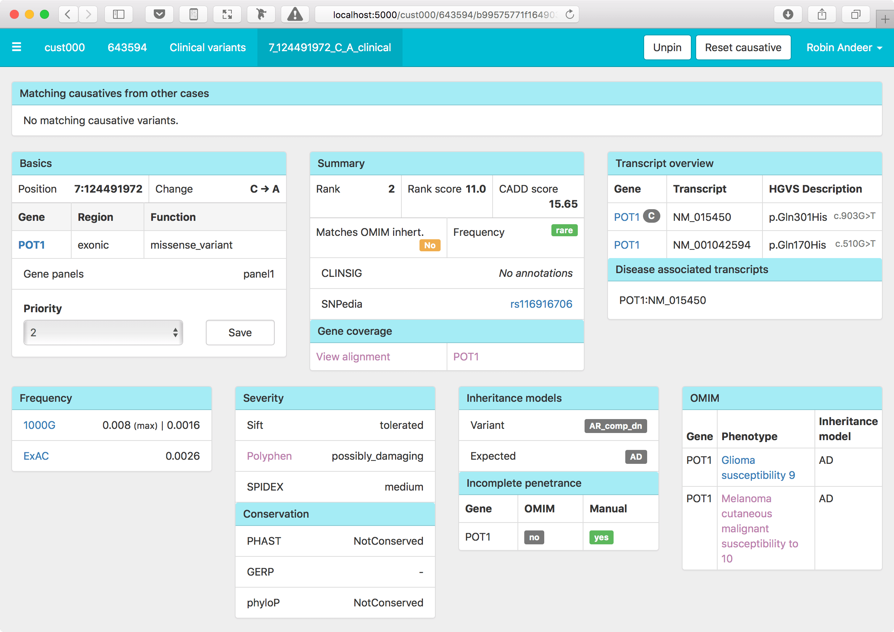

<p align="center">
	<a href="https://Clinical-Genomics.github.io/scout/">
		
	</a>
	<h3 align="center">Analyze VCFs and collaborate on solving rare diseases quicker</h3>
</p>

![Build Status - GitHub][actions-build-status]
[![PyPI Version][pypi-img]][pypi-url]
[![Coverage Status][coveralls-img]][coveralls-url]
[![GitHub issues-closed][closed-issues-img]][closed-issues-url]
[![Average time to resolve an issue][ismaintained-resolve-img]][ismaintained-resolve-url]
[![Percentage of issues still open][ismaintained-open-rate-img]][ismaintained-open-rate-url]
[](https://GitHub.com/Clinical-Genomics/scout/pulse/)
[](https://GitHub.com/Clinical-Genomics/scout/commit/)
[](https://www.codefactor.io/repository/github/clinical-genomics/scout)
[![Code style: black][black-image]][black-url]

## What is Scout?

- **Simple** - Analyze variants in a simple to use web interface.
- **Aggregation** - Combine results from multiple analyses and VCFs into a centralized database.
- **Collaboration** - Write comments and share cases between users and institutes.

## Documentation

This README only gives a brief overview of Scout, for a more complete reference, please check out our docs: https://clinical-genomics.github.io/scout .

## Runnable demo image - does not require installing of software and database

A simple demo instance of Scout requires the installation of Docker and can be launched either by using the command:
`docker-compose up -d` or `make up`.

The repository includes a Makefile with common shortcuts to simplify setting up and working with Scout. To see a full list and description of these shortcuts run: `make help`.

This demo is consisting of 3 containers:
- a MongoDB instance, on the default port 27017 in the container, mapped to host port 27013
- scout-cli --> the Scout command line, connected to the database. Populates the database with demo data
- scout-web --> the Scout web app, that serves the app on localhost, port 5000.

Once the server has started you and open the app in the web browser at the following address: http://localhost:5000/

The command to stop the demo are either `docker-compose down` or `make down`.

## Installation

<!-- You can install the latest release of Scout using `pip`:

```bash
pip install scout-browser

# ... to include optional coverage tools you would use:
pip install scout-browser[coverage]
```

If you would like to install Scout for local development: -->

```bash
git clone https://github.com/Clinical-Genomics/scout
cd scout
pip install --editable .
```

Scout PDF reports are created using [Flask-WeasyPrint](https://pythonhosted.org/Flask-WeasyPrint/). This library requires external dependencies which need be installed separately (namely Cairo and Pango). See platform-specific instructions for Linux, macOS and Windows available on the WeasyPrint installation [pages](https://weasyprint.readthedocs.io/en/stable/install.html#).

You also need to have an instance of MongoDB running. I've found that it's easiest to do using the official Docker image:

```bash
docker run --name mongo -p 27017:27017 mongo
```

## Usage

### Demo - requires pip-installing the app in a container and a running instance of mongodb

Once installed, you can setup Scout by running a few commands using the included command line interface. Given you have a MongoDB server listening on the default port (27017), this is how you would setup a fully working Scout demo:

```bash
scout setup demo
```

This will setup an instance of scout with a database called `scout-demo`. Now run

```bash
scout --demo serve
```
And play around with the interface. A user has been created with email clark.kent@mail.com so use that adress to get access

### Initialize scout

To initialize a working instance with all genes, diseases etc run

```bash
scout setup database
```

for more info, run `scout --help`

The previous command initializes the database with a curated collection of gene definitions with links to OMIM along with HPO phenotype terms. Now we will load some example data. Scout expects the analysis to be accomplished using various gene panels so let's load one and then our first analysis case:

```bash
scout load panel scout/demo/panel_1.txt
scout load case scout/demo/643594.config.yaml
```

## Integration with chanjo for coverage report visualization

Scout may be configured to visualize coverage reports produced by [Chanjo][chanjo]. Instructions on
how to enable this feature can be found in the document [chanjo_coverage_integration][chanjo-scout].

## Integration with loqusdb for integrating local variant frequencies

Scout may be configured to visualize local variant frequencies monitored by [Loqusdb][loqusdb].
Instructions on how to enable this feature can be found in the document
[loqusdb integration][loqusdb-scout].

## Integration with Gens for displaying copy number profiles for variants

Scout may be configured to link to a local [Gens][gens] installation.
Instructions on how to enable this feature can be found in the document
[Gens integration][gens-scout].

## Server setup

Scout needs a server config to know which databases to connect to etc. Depending on which
information you provide you activate different parts of the interface automatically,
including user authentication, coverage, and local observations.

This is an example of the config file:

```python
# scoutconfig.py

# list of email addresses to send errors to in production
ADMINS = ['paul.anderson@magnolia.com']

MONGO_HOST = 'localhost'
MONGO_PORT = 27017
MONGO_DBNAME = 'scout'
MONGO_USERNAME = 'testUser'
MONGO_PASSWORD = 'testPass'

# enable user authentication using Google OAuth 2.0
GOOGLE = dict(
   client_id="client_id_string.apps.googleusercontent.com",
   client_secret="client_secret_string",
   discovery_url="https://accounts.google.com/.well-known/openid-configuration"
)

# enable Phenomizer gene predictions from phenotype terms
PHENOMIZER_USERNAME = '???'
PHENOMIZER_PASSWORD = '???'

# enable Chanjo coverage integration
SQLALCHEMY_DATABASE_URI = '???'
REPORT_LANGUAGE = 'en'  # or 'sv'

# other interesting settings
SQLALCHEMY_TRACK_MODIFICATIONS = False  # this is essential in production
TEMPLATES_AUTO_RELOAD = False  			# consider turning off in production
SECRET_KEY = 'secret key'               # override in production!
```

Most of the config settings are optional. A minimal config would consist of SECRET_KEY and MONGO_DBNAME.

Starting the server in now really easy, for the demo and local development we will use the CLI:

```bash
scout --flask-config config.py serve
```



### Hosting a production server

When running the server in production you will likely want to use a proper Python server solution
such as Gunicorn.
This is also how we can multiprocess the server and use encrypted HTTPS connections.

```bash
SCOUT_CONFIG=./config.py gunicorn --workers 4 --bind 0.0.0.0:8080 scout.server.auto:app
```

For added security and flexibility, we recommend a reverse proxy solution like NGINX.

### Setting up a user login system
Scout currently supports 3 mutually exclusive types of login:
- Google authentication via OpenID Connect (OAuth 2.0)
- LDAP authentication
- Simple authentication using userid and password

The first 2 solutions are both suitable for a production server. A description on how to set up an advanced login system is available in the [admin guide](docs/admin-guide/login-system.md)


### Integration with MatchMaker Exchange

Starting from release 4.4, Scout offers integration for patient data sharing via MatchMaker
Exchange.
General info about MatchMaker and patient matching could be found in [this paper][matchmaker-pub].
For a technical guideline of our implementation of MatchMaker Exchange at Clinical Genomics and its
integration with Scout check scouts [matchmaker docs][matchmaker-scout].
A user-oriented guide describing how to share case and variant data to MatchMaker using Scout can
be found [here][matchmaker-scout-sharing].


## Development

To keep the code base consistent, formatting with [Black](https://github.com/psf/black) is always applied as part of the PR submission process via GitHub Actions. While not strictly required, to avoid confusion, it is suggested that developers apply Black locally.
Black defaults to 88 characters per line, we use 100.

To format all the files in the project run:

```bash
black --line-length 100 .
```

We recommend using Black with [pre-commit](https://github.com/pre-commit/pre-commit).
In `.pre-commit-config.yaml` you can find the pre-commit configuration.
To enable this configuration run:

```bash
pre-commit install
```

### Test

To run unit tests:

```bash
pytest
```


### Contributing to Scout

If you want to contribute and make Scout better, you help is very appreciated! Bug reports or
feature requests are really helpful and can be submitted via github issues.
Feel free to open a pull request to add a new functionality or fixing a bug, we welcome any help,
regardless of the amount of code provided or your skills as a programmer.
More info on how to contribute to the project and a description of the Scout branching workflow can
be found in [CONTRIBUTING](CONTRIBUTING.md).


[chanjo]: https://github.com/Clinical-Genomics/chanjo
[chanjo-scout]: docs/admin-guide/chanjo_coverage_integration.md
[loqusdb]: https://github.com/moonso/loqusdb
[loqusdb-scout]: docs/admin-guide/loqusdb_integration.md
[gens]: https://github.com/Clinical-Genomics-Lund/gens
[gens-scout]: docs/admin-guide/gens_integration.md
[matchmaker-pub]: https://www.ncbi.nlm.nih.gov/pmc/articles/PMC6016856/
[matchmaker-scout]: docs/admin-guide/matchmaker_exchange_integration.md
[matchmaker-scout-sharing]: docs/user-guide/cases.md#matchmaker-exchange-integration
[travis-img]: https://img.shields.io/travis/Clinical-Genomics/scout/develop.svg?style=flat-square
[travis-url]: https://travis-ci.org/Clinical-Genomics/scout
[pypi-img]: https://img.shields.io/pypi/v/scout-browser.svg?style=flat-square
[pypi-url]: https://pypi.python.org/pypi/scout-browser/
[ismaintained-resolve-img]: http://isitmaintained.com/badge/resolution/Clinical-Genomics/scout.svg
[ismaintained-resolve-url]: http://isitmaintained.com/project/Clinical-Genomics/scout
[ismaintained-open-rate-img]: http://isitmaintained.com/badge/open/Clinical-Genomics/scout.svg
[ismaintained-open-rate-url]: http://isitmaintained.com/project/Clinical-Genomics/scout
[closed-issues-img]: https://img.shields.io/github/issues-closed/Clinical-Genomics/scout.svg
[closed-issues-url]: https://GitHub.com/Clinical-Genomics/scout/issues?q=is%3Aissue+is%3Aclosed
[coveralls-img]: https://coveralls.io/repos/github/Clinical-Genomics/scout/badge.svg?branch=master
[coveralls-url]: https://coveralls.io/github/Clinical-Genomics/scout?branch=master
[actions-build-status]: https://github.com/Clinical-Genomics/scout/workflows/Scout%20tests/badge.svg
[black-image]: https://img.shields.io/badge/code%20style-black-000000.svg
[black-url]: https://github.com/psf/black
