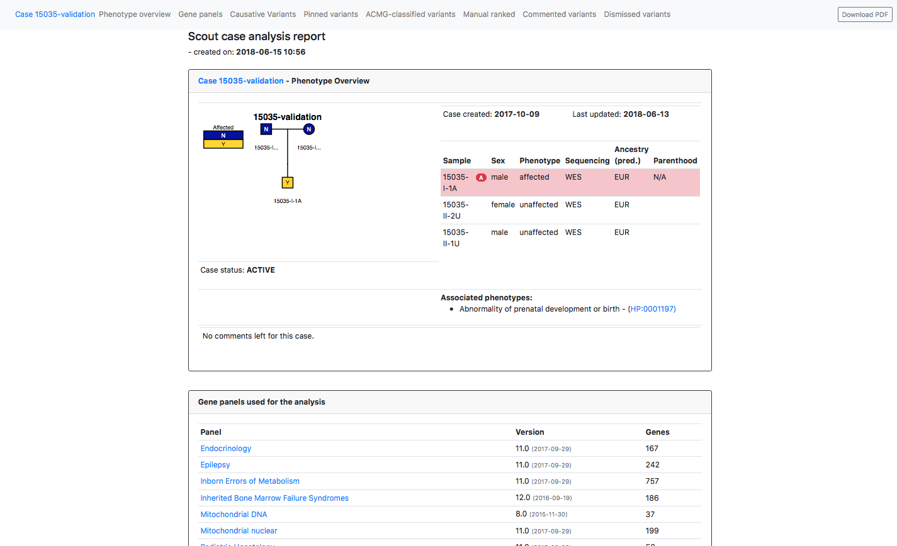

## What's new in 4.0.0? 🍁

_Posted: 15 June 2018_

This major update includes the following highlights:

## New features

- Finally!! There will always be a downloadable case report available at case page (great stuff @northwestwitch)🦄

  

- Scout now uploads ALL variants from the mitochondrial chromosome (MT) - independently of rank score both for clinical and research variants

- Filter on spidex levels are now available

- Filter on chromosome is possible, mainly to get easy access to MT variants

- It is possible to produce a clinvar submission files from the case page that could be used to submit variants to clinvar

- All existing HPO terms now lives in scout. They should also be presented in a more relevant order when searched for

- Users can choose how many cases that should be displayed on case page (thanks @dnil 🐝)
## Bugfixes

- Clinvar annotations are back!
- Compound links will work when all compounds are uploaded for a region
- Sanger order can be removed
- Polyphen annotation is back

There are many more things that has been worked on "under the hood", we hope that you will have a better experience with Scout.
