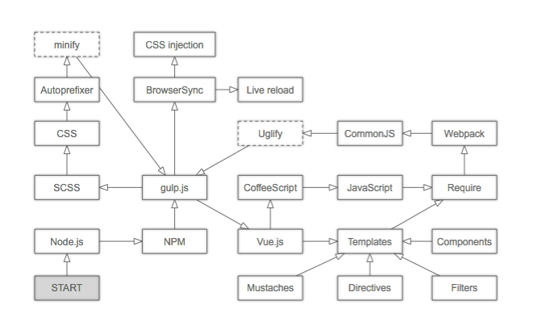

# Development

## Core developers

- Robin Andeer (RA)
- Måns Magnusson (MM)
- Henrik Stranneheim (HS)
- Mats Dahlberg (MD)


## Flask structure
Blueprints separate as much logic as possible from the central Flask server. This includes views, templates, and static assets but not yet Flask extensions.


## Fixtures data
The default fixtures adapter is implemented in ``chanjo.ext.backend.FixtureAdapter``. If you are writing a new adapter, please look at the implementation of the ``FixtureAdapter`` and ``BaseAdapter`` to follow the defined API style.


## Frontend
Node.js compiles frontend assets such as [SCSS](http://sass-lang.com/) modules and [Vue.js](http://vuejs.org/) components. It's also responsible for auto-reloading the browser when updates are made to the files. All this functionality is centralized to [gulp.js](http://gulpjs.com/). An overview of how all components of this system are connected is visualized below:



To start watching files and compile and reload automatically run:

```bash
$ gulp
```

All assets are already bundled but before deployment one should compile the files for production (Uglify + minify). This is accomplished as such:

```bash
$ gulp build --production
```
