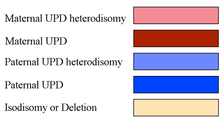

## Cases
This page displays the list of active cases for a particular institute. Each item links to the detailed view for that case. You can filter the list by typing into the search box above the list.

A quick link to get straight to the list of all clinical variants is also displayed. To indicate what cases have recently been added/updated, a "last updated" date is also displayed.

Sometimes you will also see a cyan colored dot to the left of the case ID. This is an indicator that there's been some recent activity in the case such as a new comment.

Your name will be tagged for each case that is assigned to you. For cases that are assigned to other people you will see a tag "ASSIGNED".

In the search field you can enter search terms to limit the list displayed. Entering a user name shows only cases assigned to that user. A case- or sample id will return only cases with matches to those ids.

A search starting with "HP:", e.g. "HP:0002664" will return cases with exactly matching [HPO phenotype terms](../features/hpo.md).

A search starting with "synopsis:", e.g. "synopsis:epilepsy" will return cases with free text matches to the string following "synopsis:".

## Case
This is the detailed view of one individual case. The intended use is to give a concise overview of the family under investigation and show recent activity related to the case.

## Case report page
It can be visualized by clicking on the 'Visualize report' link on the left sidebar present on the case view. The case report contains a phenotype info panel as well as an overview of the gene panels used for the analysis. This page is showing also any variant users have been interacting with when working with the case: causative variants, variants pinned as candidates, ACMG or otherwise manually classified variants, as well as variants with any comment field. At the bottom of the report page the 'Dismissed variants' panel lists all variants that have been dismissed, with the reason(s) why they were rejected as candidates. By clicking on the top right button the case report can be exported and saved into a PDF file.

### Pinned variants
There's a list of "Strong candidates" on the page. This list is curated by the collaborators and consists of "pinned" variants from the variants list. This feature can be used to mark variants of particular interest that you might want to highlight to other users. Pinned variants for cases with at least one assigned HPO phenotype can be used to produce Clinvar submission files (See more under "Variant").

### Matching causatives
The case page shows a list of matching causative variants from other cases in a foldable tab. By default only the number of matches is displayed. The user can click to open the tab and expose links to the variant in the case where it has been marked causative.

### Managed variants
The case page shows a list of matching managed variants from other cases in a foldable tab. By default only the number of matches is displayed. The user can click to open the tab and expose a list of managed variants found in the case.

### Misc.
The case page also displays a simple wiki-style synopsis on the current case that can be used to communicate information on the case to collaborators. The synopsis and other fields on the case page can be populated directly on load - see the admin section.

Rank model version shows which rank model that has been used to rank the variants in the case

The "Activity" feed is a reverse chronological list of events and comments related to the case. Examples of events include comments, status updates, assignments, Sanger sequencing orders etc.

### Cytogenomics 
The case page contains three (admin configuration optional) cytogenomics applications: [Gens](https://github.com/Clinical-Genomics-Lund/gens), [Chromograph](https://github.com/mikaell/chromograph) and [vcf2cytosure](https://github.com/NBISweden/vcf2cytosure).
Gens integration is available via the "View CN profile" button on the case page as well as the "Copy number profile" links under SV variant summary on each SV variant page.
Chromograph integration can be found under the Images cards on the case page. Chromograph will display ideograms, genome coverage from [TIDDIT](https://github.com/SciLifeLab/TIDDIT) (orange graph), autozygosity from [rhocall][rhocall] (gray bars) and UPD calls from [UPD.py](https://github.com/bjhall/upd). UPD calls are colored deep red for maternal UPD candidate regions,
light pink for maternal heterodisomy calls, deep blue for paternal UPD, light blue for paternal heterodisomy and beige for unspecific isodisomy or deletion calls.

Vcf2cytosure files can be accessed from the individuals table, where a download link arrow appears in the CGH column if it is available.

### Actions
There are a few actions you can take on this page.

**Adopt case**: By clicking the button next to "Adopt" you can assign yourself to a case. More than one person can be assigned to a case, e.g. if multiple professions or institutes are involved in analysis. If you have assigned yourself to a case you can click your name to "unassign".

The case can be moved to "Research" which means all variants will be made visible for the entire exome. Clicking "Open research" will notify the administrators of the site. The user agrees that she is reponsible to have acquired an informed consent relevant for this action. This will also be logged as a new event in the case log.

**Edit case synopsis**: The case sysnopsis can be edited in a format known as [Markdown][markdown]. Just click "EDIT" to open the editor view. When you are finished click "SAVE" to save changes or "CANCEL" to abort.

**Comment**: You can leave comments in the activity log by writing a message in the input box next to the feed. Click "COMMENT" to submit the comment.

### Matchmaker Exchange integration

Starting with release 4.4, Scout offers integration for patient data sharing via Matchmaker Exchange. General info about Matchmaker and patient matching could be found in [this paper](https://www.ncbi.nlm.nih.gov/pmc/articles/PMC6016856/).

Authorized users (contact Scout admins if you wish to start sharing cases using this network!) will have access to a Matchmaker submission form present on the case page:

#### Requisites to share patient data using Matchmaker (MME):
- There must be **at least one HPO term specified at the case level AND/OR one pinned variant**.
- A **maximum number of 3 variants** can be exported to Matchmaker Exchange for a case.
- Submitting users are willing to be contacted (via email) by users from external Matchmaker nodes in case of positive patient matching.
- Matchmaker Exchange network discourages the submission of variants which are already known to case a certain phenotype and **welcomes instead the submission of novel or unknown but strongly suspected variants for the condition**.

#### Patient sharing options
- Including **patient gender** is optional
- Including an **HPO term** is required if there is no pinned variant at the case level
- Including **OMIM diagnosis** is not mandatory, but could be of help to the matching algorithm when looking for similar patients on MME.
- Submitting users can decide to share **specific variant data** (chromosome, position, specific change, zygosity) **or only gene name**. Providing complete information will of course improve matching power.

Submitted patients can be modified or removed from Matchmaker any time from the Scout case page.

From the same interface, by clicking on 'match against', users will be able to run matches against Scout patients already submitted to Matchmaker or patients present in connected external nodes:

By clicking on 'Matches', users can review the submitted data for a case (**Patient Overview** tab) and all **positive** match results for a case against patients from external nodes (**External Matches**) or other Scout patients in Matchmaker server (**Internal Matches**):

Matches will be ordered by date and each single match object will display matching patients by score, from the highest (most similar to the case) to the lowest(least similar to the case).

----------
[rhocall]: https://github.com/dnil/rhocall
