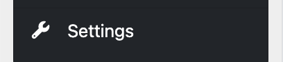
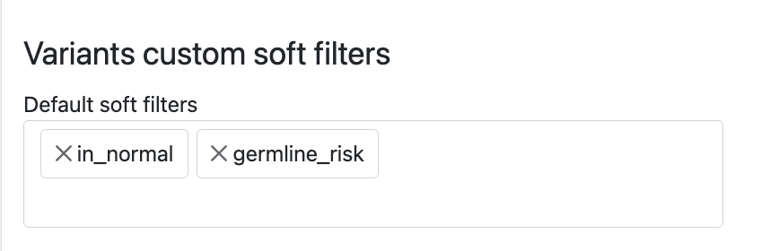
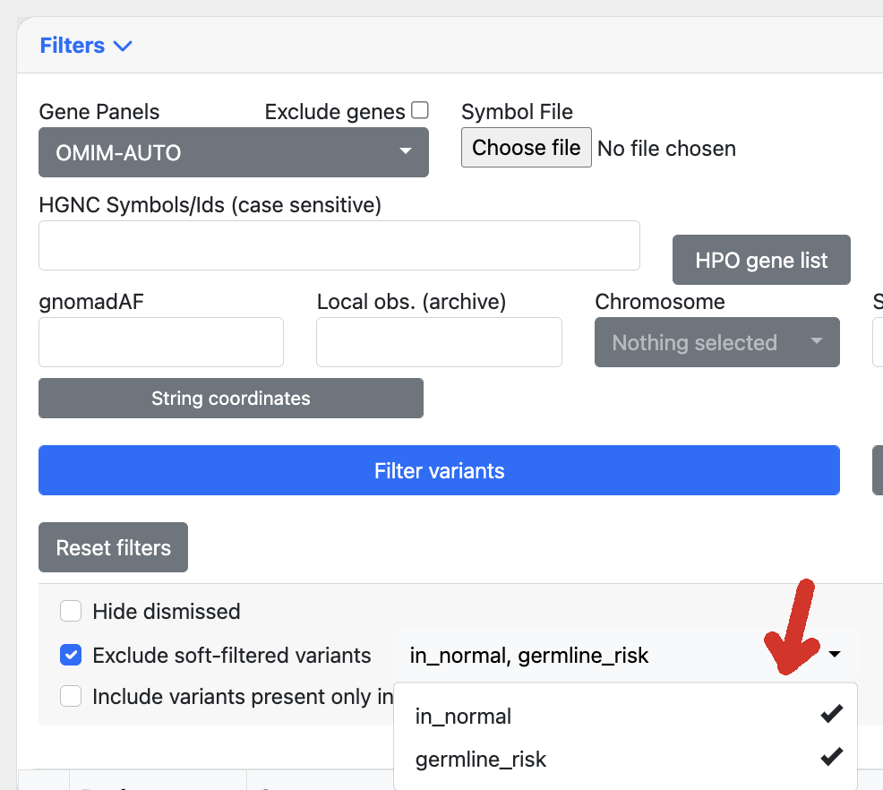

# Institute Settings

The **Institute Settings** page is accessible from the left sidebar of the institute page.

Both common users and administrators can access this page:

- **Admins**: full access to all settings
- **Users**: limited access to selected settings

---

## General Settings

Available to all users.

| Setting                   | Description                                                                 |
|---------------------------|-----------------------------------------------------------------------------|
| **Institute display name** | Name shown across Scout pages (does not change the institute ID).          |
| **Sanger recipients**      | Email addresses that receive Sanger verification emails.                   |
| **Coverage cutoff**        | Coverage threshold for reliable variant display; used in Chanjo/Chanjo2 reports. |
| **Frequency cutoff**       | Lower frequency threshold for displaying variants (e.g. clinical filters). |

---

## Case Display Settings

Available to admin users only.

Controls which case categories are always shown on the case page. Nothing selected defaults to `prioritized`.

- Default: **prioritized**
- Other options: `inactive`, `ignored`, `active`, `solved`, `archived`

---

## Phenotype Groups

Available to all users.

From this page, users can create new phenotype groups. These custom groups can later be selected and applied from the case page.

| Setting                    | Description                                                                                                  |
|----------------------------|--------------------------------------------------------------------------------------------------------------|
| **New phenotype group**    | Select HPO terms available in Scout to define a new phenotype group.                                        |
| **Abbreviation**           | Short name used to identify the phenotype group.                                                            |
| **Custom phenotype groups**| List of user-defined phenotype groups available for quick assignment on the case page.                      |

---

## Cohorts

Available to all users.

Defines custom labels used to categorize and filter cases.

---

## Variants and Gene Panel Searching

Available to all users.

Defines collaborators, available gene panels, and search configuration.

| Setting                                | Description                                                      |
|----------------------------------------|------------------------------------------------------------------|
| **Institutes to share cases with**     | Selected institutes that users can share this institute’s cases with.      |
| **Gene panels for variant filtering**  | Gene panels available when filtering variants on variant pages. Note that all cases may not have been processed bioinformatically to return variants from all genes in the clinical setting. If so the search will still return a message saying the gene was not among the clinical genes for the case. Consider opening the case for research or ordering a rerun. |

---

## ClinVar API Submissions

Available to all users.

Optional settings to support germline and oncogenic submissions to ClinVar.

| Setting                | Description                                                                 |
|------------------------|-----------------------------------------------------------------------------|
| **API key**            | ClinVar API key obtained from the ClinVar portal. See [ClinVar API docs](https://www.ncbi.nlm.nih.gov/clinvar/docs/api_http/). |
| **ClinVar submitters** | Users allowed to submit variants to ClinVar from Scout. |

---

## LoqusDB

Available to admin users only.

This setting is a multiselect field containing one or more available LoqusDB instances configured in Scout settings.
The selected instances are used on variant pages to display local observations of each variant across the chosen databases.

---

## Variants custom soft filters

Available to admin users only.

Custom soft filters to be used for filtering variants can be defined here.
The soft filters act on variant filters, as parsed from VCF FILTER column at variant load time, typically when the case is loaded. These could be directly from variant callers or custom defined filters from a pipeline. 

For instance the following soft filters defined in settings:

---

## Alamut Plus

Available to admin users only.

| Setting                  | Description                                                                                                                           |
|--------------------------|---------------------------------------------------------------------------------------------------------------------------------------|
| **Alamut Plus API key**  | API key used to connect to an instance of [Alamut Plus](https://www.sophiagenetics.com/sophia-ddm-for-genomics/alamut-visual-plus/). |
| **Alamut Institution ID**| Text identifier representing your institution within the configured Alamut Plus instance.                                           |

